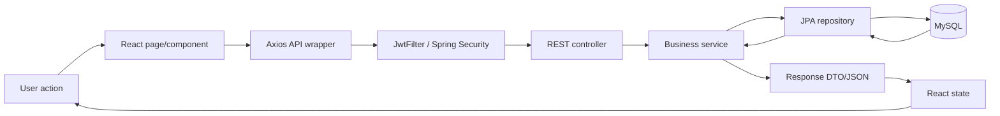
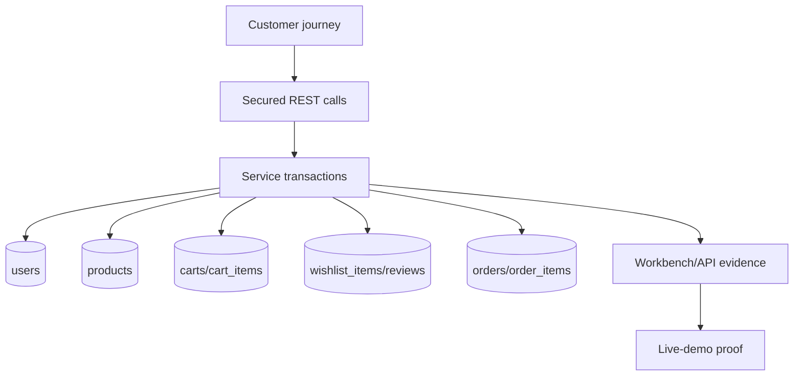
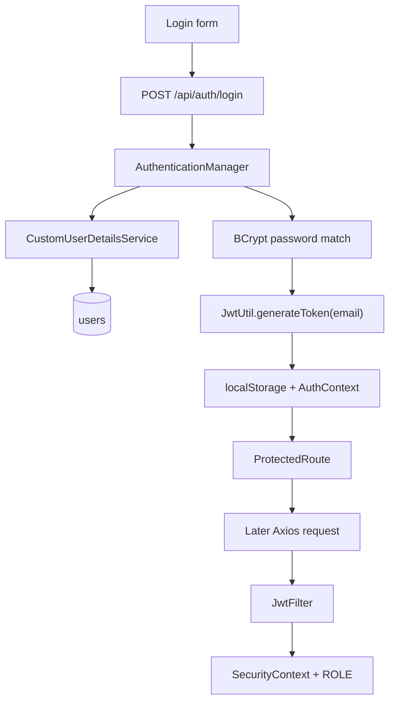
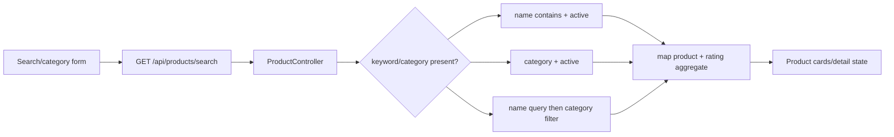
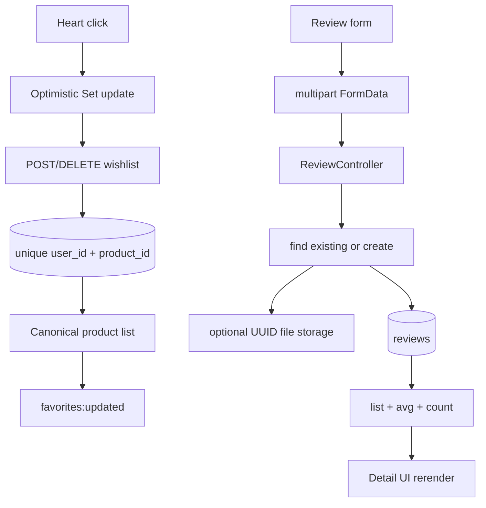
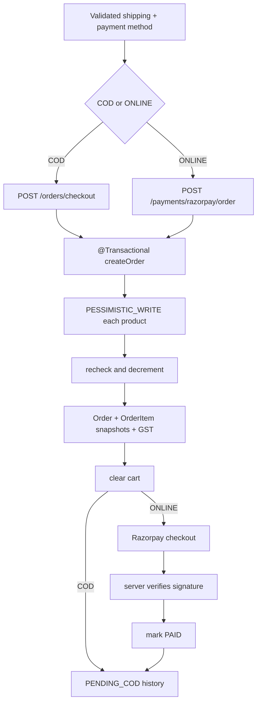
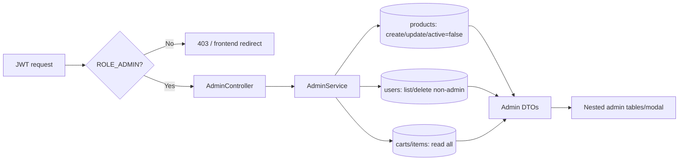

# Per-Member Technical Guides, Viva Banks, and Revision Sheets

This companion uses **seven modules and eight named presenters**. Oshi and Annu co-own Module 1 but have separate study goals and separate 30-question banks. Paths are repository-relative. “Shared” means multiple presenters must study the file from their own module's perspective.

## Shared baseline for all members

Study these before module-specific files:

- `ecommerce-frontend/src/App.jsx` — root providers and theme initialization.
- `ecommerce-frontend/src/routes/AppRoutes.jsx` — every public/protected/admin route.
- `ecommerce-frontend/src/api/axiosInstance.js` — API base URL, JWT injection, and global 401 behavior.
- `src/main/java/com/ecommerce/config/SecurityConfig.java` — the real endpoint authorization boundary.
- `src/main/java/com/ecommerce/exception/GlobalExceptionHandler.java` — validation/runtime JSON shape.
- `src/main/resources/application.properties` — ports, DB/JWT/mail/payment/upload configuration; never display secrets.
- `database/ecommerce_db.sql` — schema constraints, starter admin, and product seed data.

---

# 1. Oshi — Introduction, feature map, and high-level architecture

## A. Module overview

Oshi explains what the running project is and how its major parts collaborate. Her job is not a generic e-commerce introduction; it is to establish the vocabulary needed by every later presenter: SPA, modular monolith, REST, JWT, layered backend, ORM, relational database, external adapters, and state ownership. She should be able to point from every visible feature to the responsible frontend/backend/data layer without diving into each algorithm.

## B. Files Oshi must study

- `pom.xml` — Java 17/Spring Boot and backend dependency inventory.
- `ecommerce-frontend/package.json` and `vite.config.js` — React/Vite/Axios/Router/Tailwind/Motion stack and build.
- `ecommerce-frontend/src/main.jsx` — React DOM bootstrap and StrictMode.
- `ecommerce-frontend/src/App.jsx` — BrowserRouter, AuthProvider, theme.
- `ecommerce-frontend/src/routes/AppRoutes.jsx` — application screen map and route guards.
- `ecommerce-frontend/src/components/Layout.jsx`, `Navbar.jsx`, `Footer.jsx` — shared authenticated shell.
- `ecommerce-frontend/src/context/AuthContext.jsx` — global identity lifecycle.
- `ecommerce-frontend/src/api/axiosInstance.js` — frontend/backend boundary.
- `src/main/java/com/ecommerce/EcommerceProjApplication.java` — Spring Boot entry point.
- All eight controller files — API surface by domain; understand endpoints, not every line.
- `SecurityConfig.java`, `JwtFilter.java` — request security pipeline.
- All service interfaces — business capability contracts.
- All eight entity files and `database/ecommerce_db.sql` — domain vocabulary/relationships.

## C. Functions Oshi must understand

- `main.jsx:createRoot(...).render(App)` — input DOM root; output mounted React tree.
- `App()` — reads theme preference; returns Router -> AuthProvider -> route table.
- `AppRoutes()` — maps URLs to pages and wraps protected/admin routes.
- Axios request interceptor — input request config; output config with optional Bearer header.
- Axios response interceptor — input rejected response; clears identity on 401.
- `EcommerceProjApplication.main(args)` — starts component scanning, embedded server, and Spring context.
- `SecurityConfig.filterChain(http)` — returns stateless authorization/filter policy.
- Controller methods generally — validated HTTP request -> service call -> response DTO.
- Service methods generally — principal/business input -> rule/transaction/repository work -> DTO.

## D. Workflow Oshi should narrate



She should use login, add-to-cart, and checkout as three examples of the same pipeline with different rules.

## E. Backend knowledge required

- Controllers handle transport, DTO binding, and principal extraction; services own rules; repositories own persistence access.
- JPA entities map relationships; response DTOs prevent direct entity serialization.
- Spring Security executes before protected controller methods.
- `@Transactional` defines atomic business operations, especially checkout.
- MySQL constraints defend uniqueness/referential integrity even if service checks race.
- Razorpay, SMTP, and filesystem uploads are external/secondary adapters, not separate microservices owned by the app.

## F. Oshi's 30 difficult viva questions with answers

1. **Is this microservices architecture?** No. It is one Spring Boot deployable and one database, internally divided into domain packages: a layered modular monolith plus a separately built SPA.
2. **Why call React a SPA?** Navigation changes client-side through React Router without a full document reload; data arrives through REST calls and components rerender.
3. **Where is MVC in this project?** Spring controllers are the HTTP controller layer, entities/DTOs/services form the model/business side, while React—not server templates—is the view.
4. **Why separate frontend and backend?** It creates a reusable API boundary, independent UI/backend build cycles, and clear security/business ownership, at the cost of CORS and two runtimes.
5. **What makes the backend layered?** Dependencies flow controller -> service -> repository -> entity/database; each layer has a narrower responsibility.
6. **Why use DTOs instead of returning entities?** DTOs control the contract, validation, and exposed fields; they avoid leaking passwords and ORM relationship graphs.
7. **Where is business logic located?** Primarily service implementations such as `CartServiceImpl` and `OrderServiceImpl`, not React pages or controllers.
8. **What is dependency injection here?** Spring creates services/repositories/configuration and injects collaborators, reducing manual construction and coupling.
9. **What is the role of Vite?** It serves the development SPA with fast module updates and bundles optimized static HTML/CSS/JS for production.
10. **Why Axios?** It centralizes the base URL and JWT/401 interceptors while exposing Promise-based request helpers.
11. **Why MySQL instead of localStorage for commerce data?** MySQL gives durable, multi-user, transactional, constrained state; localStorage is browser-specific and untrusted.
12. **What is ORM?** Hibernate maps Java entities/relations to tables/foreign keys and generates SQL behind Spring Data repositories.
13. **Does JPA eliminate SQL knowledge?** No. Query shape, indexes, joins, locks, transactions, and N+1 behavior still determine correctness/performance.
14. **What starts first?** Operationally MySQL, then Spring Boot, then Vite. React can render without the backend, but feature requests fail.
15. **Why is port 8081 important?** Spring is configured there, and Axios uses `http://localhost:8081/api`; a mismatch breaks all frontend API calls.
16. **What is stateless authentication?** The server keeps no login session; each protected request carries a verifiable JWT and reconstructs authentication.
17. **What happens on a 401?** The Axios response interceptor removes token/user data and performs a hard redirect to `/login`.
18. **What is a modular monolith advantage?** Transactions and deployment are simple while code retains domain boundaries; it avoids distributed-system overhead.
19. **Its disadvantage?** Scaling/deployment are coarse-grained, and weak package boundaries can become tight coupling as the codebase grows.
20. **Where are external systems?** Razorpay for payment orders/signatures, Gmail SMTP for reset mail, remote URLs for product images, and local disk for review images.
21. **Why is the browser not trusted?** Users can alter JS, payloads, totals, IDs, and localStorage; backend services therefore revalidate ownership, stock, totals, and signatures.
22. **What happens from DB back to UI?** Hibernate creates entities, services map DTOs, Jackson serializes JSON, Axios resolves a Promise, and React sets state and rerenders.
23. **What state is global?** Authenticated user is Context-global; wishlist logic is shared through a hook/events; most form and page data stays local.
24. **Why no Redux?** Current cross-page state is small enough for Context, hooks, server refetches, and events; adding Redux would add ceremony without clear need.
25. **Which frontend patterns are used?** Provider/Context shares authentication, custom hooks encapsulate wishlist behavior, and route guards control navigation based on identity and role.
26. **What is server-authoritative data?** Stock, roles, totals, ownership, orders, and payment status are accepted only from backend/database calculations, not UI display state.
27. **What proves separation of concerns?** Pages call tiny API functions, controllers call interfaces, services use repositories, and DTOs isolate transport from persistence.
28. **What is the most critical transaction?** Order creation: stock validation/decrement, order snapshots, totals, and cart clearing must succeed or roll back together.
29. **What architectural issue is visible?** CORS/base URLs are localhost-specific and repeated; production should use environment configuration and centralized CORS.
30. **Give the project in one technical sentence.** A React SPA consumes a stateless JWT-secured Spring Boot layered REST API whose JPA services persist transactional commerce aggregates in MySQL and integrate payment, mail, and file storage.

## G. Common traps and confident answers

- **“Show the microservice.”** Say there is none; falsely calling controllers microservices is incorrect.
- **“React talks directly to MySQL, correct?”** No; it only talks HTTP to Spring. Repositories/Hibernate access MySQL.
- **“JWT encrypts everything.”** JWT here is signed, not encrypted; HTTPS must protect transport.
- **“Frontend route protection is security.”** It is UX only; Spring Security is enforcement.
- **“Are all APIs public?”** No. Only authentication endpoints, product GET requests, and uploaded images are public; other customer APIs require JWT and admin APIs require `ROLE_ADMIN`.

## H. Oshi checklist and 2-minute revision

- [ ] Can draw the four main layers and three external adapters.
- [ ] Can explain SPA, REST, DTO, ORM, JWT, modular monolith.
- [ ] Knows ports 5173/8081/3306 and startup order.
- [ ] Can route each feature to its owner.
- [ ] Can answer why DTO/service/repository separation exists.

**Two-minute sheet:** React/Vite -> Axios -> Spring Security/JWT -> controller -> service -> JPA -> MySQL -> DTO -> React. One deployable backend means modular monolith. Server owns rules; browser owns interaction. External: Razorpay, Gmail, upload disk. Transition: “Annu will now show how these modules share one data model and how we verify the integrated flow.”

---

# 2. Annu — Database, integration flow, and live-demo leadership

## A. Module overview

Annu owns the connective tissue: relational design, transaction boundaries, cross-module state changes, technical limitations, integration evidence, and live-demo sequencing. As team lead, she must recover gracefully if a segment fails and answer questions spanning multiple owners.

## B. Files Annu must study

- `database/ecommerce_db.sql` — all tables, foreign keys, uniqueness, seed rows, delete actions.
- All entity files — JPA cardinality, cascade/orphan removal, lifecycle timestamps.
- All repository files — derived queries, JPQL average, pessimistic lock.
- `OrderServiceImpl.java` and `RazorpayPaymentService.java` — deepest transaction/integration paths.
- `ReviewDataInitializer.java` — startup data behavior.
- `application.properties`, `application-local.example.properties` — configuration and secret risks.
- `GlobalExceptionHandler.java` — cross-module error behavior.

## C. Functions Annu must understand

- Entity `@PrePersist/@PreUpdate` callbacks — assign timestamps.
- `Cart.getTotalPrice()` — derives cart sum (currently `double`).
- Repository derived methods — method signature becomes SQL/query intent.
- `ProductRepository.findByIdForUpdate` — locks product row within transaction.
- `OrderServiceImpl.createOrder` — performs full atomic order mutation.
- `ReviewDataInitializer.run` — idempotent-per-product demo review seeding.
- `GlobalExceptionHandler.handleValidation/handleRuntime` — cross-module error response shapes and their current HTTP-status limitation.
- Repository relationship/query methods — turn domain lookups, uniqueness checks, aggregates, and locks into database work.

## D. Workflow



## E. Backend/database knowledge required

- PK/FK/cardinality for eight tables; one-to-one cart; many-to-one product/user references.
- Unique email, one wishlist/review per user-product, unique Razorpay IDs.
- Cascade/orphan semantics versus SQL `ON DELETE` actions.
- Transaction atomicity and pessimistic locking in checkout.
- Snapshot fields in cart/order items and why normalization is intentionally relaxed for history.
- Index/performance issues: product aggregate N+1, lazy relations, and query projections.
- Schema drift: reset-token fields are in entity but not bootstrap SQL.

## F. Annu's 30 difficult viva questions with answers

1. **Why eight tables?** Each represents a distinct entity/association: users, products, one cart per user, cart lines, saved products, reviews, order headers, and immutable-ish order lines.
2. **Why is Cart-User one-to-one?** The design maintains a single active persistent cart per account; DB uniqueness on `carts.user_id` enforces it.
3. **Why are CartItems separate rows?** A cart is a variable-size aggregate; each row links one product with quantity and snapshot price.
4. **Why duplicate product data in OrderItem?** Name/image/unit price are historical snapshots so later product edits do not rewrite old receipts.
5. **What does a foreign key prevent?** It prevents child rows from referencing nonexistent parents and defines delete constraints/cascades.
6. **Service duplicate checks versus unique constraints?** Service checks give friendly responses; DB uniqueness is the final race-safe guarantee.
7. **What does `ON DELETE RESTRICT` for ordered products mean?** A referenced product cannot be physically removed, which supports history; product soft deletion avoids the conflict.
8. **Why can user deletion cascade?** The SQL chooses to remove the user's dependent carts, wishlists, reviews, and orders; that is simple but may conflict with real audit-retention requirements.
9. **What is transaction atomicity?** All writes in checkout commit together or roll back together after an unchecked exception.
10. **Why a pessimistic product lock?** Concurrent checkouts serialize stock access so both cannot read the same available quantity and oversell.
11. **Could deadlocks occur?** Yes, two orders locking products in different order can deadlock; sort product IDs before locking and rely on DB retry policy.
12. **Why BigDecimal for money?** Decimal values avoid binary floating-point rounding; scale and rounding mode make GST deterministic.
13. **Where is money inconsistent?** `Cart.getTotalPrice()` converts to `double`; a stronger design returns BigDecimal through cart DTOs.
14. **What is orphan removal?** Removing a child from the owning collection causes Hibernate to delete its row, used when clearing cart items.
15. **CascadeType.ALL risk?** Parent operations propagate; used carelessly it can delete/update more data than intended and should match aggregate ownership.
16. **What does `ddl-auto=update` do?** Hibernate changes schema to match entities; convenient locally, but migrations are safer and auditable in production.
17. **What schema drift exists?** `User` has reset-token fields missing from `ecommerce_db.sql`; Hibernate update hides that mismatch.
18. **What is N+1 here?** Mapping each product runs separate average and count review queries, so one list can create 1 + 2N database calls.
19. **How optimize rating aggregates?** Use a grouped projection/query joining reviews, cached/materialized aggregates, or batch queries.
20. **Why seed reviews in an ApplicationRunner?** It runs after context startup and uses repositories/transactions, but production should profile-gate demo seed data.
21. **Is the initializer fully idempotent?** It skips a product if any review exists, so it avoids duplicates but also never fills missing demo reviewers for a partially reviewed product.
22. **Optimistic versus pessimistic locking?** Optimistic locking detects conflicting updates, commonly through a version column; pessimistic locking blocks conflicting writers immediately, as checkout does for products.
23. **How do you prove one action crossed every layer?** Correlate the browser Network request and response ID with controller/service code, affected MySQL rows, changed product stock, cleared cart, and refreshed UI.
24. **Why do indexes matter?** Foreign-key and frequently searched columns determine lookup/join cost; indexes accelerate reads but consume storage and add write overhead.
25. **What should replace `ddl-auto=update` in controlled deployment?** Versioned migrations such as Flyway or Liquibase make every schema change reviewable, repeatable, and reversible by procedure.
26. **How can lost updates outside checkout be prevented?** Use `@Version` optimistic locking, row locks, atomic SQL updates, unique constraints, and bounded retries according to the operation.
27. **JPA cascade versus SQL `ON DELETE CASCADE`?** JPA cascade propagates entity operations inside the ORM, while SQL cascade is enforced by the database regardless of which client executes the delete.
28. **What if Razorpay creation fails after local order work?** The runtime exception rolls back the surrounding transaction if the remote call fails synchronously, but external side effects and long transactions remain concerns.
29. **What if payment is cancelled after order creation?** Current order remains payment-pending and stock stays reduced; there is no compensation/expiry job.
30. **How do you prove end-to-end correctness live?** Correlate one browser action's Network request, backend response/order ID, MySQL order/order-item/product/cart changes, and refreshed UI.

## G. Common traps and confident answers

- **“Normalized databases never duplicate values.”** Historical snapshots deliberately denormalize commercial facts.
- **“Transactions include Razorpay atomically.”** A DB transaction cannot atomically control a remote system; the current synchronous structure only rolls back local work on thrown failure.
- **“The SQL script is the only schema truth.”** Currently both entities and `ddl-auto=update` affect schema; note the reset-field drift.
- **“If the UI changed, the database must be correct.”** Not necessarily; prove the persisted result by correlating response identifiers and database rows rather than trusting visual state alone.
- **“No race condition because Java is single-threaded.”** Web requests are concurrent; the database lock is essential.

## H. Annu checklist and 2-minute revision

- [ ] Can draw all table relations and explain each constraint.
- [ ] Can trace order IDs across UI, API, and DB.
- [ ] Can explain transaction, lock, cascade, orphan removal, snapshot.
- [ ] Knows which verification actually passed and which was not run.
- [ ] Has primary demo, recording, screenshots, and failure transitions.

**Two-minute sheet:** Eight tables; unique user cart/wishlist/review pairs; order snapshot. Checkout is transaction + product row locks + GST + cart clear. Online gap: pending payment keeps stock. Demo proof must correlate Network, JSON, rows, and UI. Transition into Radhika: “The common flow begins by establishing a trusted user identity.”

---

# 3. Radhika — Authentication, authorization, password reset, and profile

## A. Module overview

Radhika owns the complete identity vertical slice: public forms, server validation, BCrypt credential storage, Spring authentication, JWT generation/filtering, route guards, current-user restoration, profile mutation, and reset mail/token lifecycle.

## B. Files Radhika must study

**Frontend:** `LoginPage.jsx`, `RegisterPage.jsx`, `ForgotPasswordPage.jsx`, `ResetPasswordPage.jsx`, `ProfilePage.jsx`, `AuthContext.jsx`, `ProtectedRoute.jsx`, `AdminRoute.jsx`, `authApi.js`, `axiosInstance.js`, `AppRoutes.jsx`.

**Backend:** `AuthController.java`, `AuthService.java`, `AuthServiceImpl.java`, `MailService.java`, `SecurityConfig.java`, `JwtFilter.java`, `JwtUtil.java`, `CustomUserDetailsService.java`, `User.java`, `UserRepository.java`, `LoginRequest.java`, `RegisterRequest.java`, `AuthResponse.java`, `ForgotPasswordRequest/Response.java`, `ResetPasswordRequest.java`, `UpdateProfileRequest.java`, `ProfileResponse.java`, `GlobalExceptionHandler.java`.

Each frontend page owns form UX; API/context files own session transport/state. The controller defines endpoints; service owns identity rules; security classes authenticate every later request; User/repository persist identity/reset state; DTOs define safe validated contracts.

## C. Major functions

- `LoginPage.handleSubmit(form)` -> AuthResponse; stores user/token through `login`; navigates dashboard.
- `RegisterPage.handleSubmit(form)` -> creates USER and logs in.
- `AuthProvider` effect -> verifies stored real token using `/auth/me`; avoids protected-page flash.
- `AuthProvider.login/updateUser/logout` -> localStorage + React state mutations.
- `AuthServiceImpl.register(RegisterRequest)` -> uniqueness, BCrypt, save, JWT, safe response.
- `login(LoginRequest)` -> `AuthenticationManager` validation, user load, JWT.
- `forgotPassword` -> random raw token, SHA-256 digest storage, 30-minute expiry, optional mail/fallback link.
- `resetPassword` -> hash submitted token, expiry check, BCrypt new password, clear token.
- `updateProfile` -> unique email, optional current-password check/new hash, save, new JWT.
- `JwtFilter.doFilterInternal` -> extract/validate token, load authorities, set SecurityContext.

## D. Workflow



## E. Backend knowledge required

Know which endpoints are public; how `@AuthenticationPrincipal` gets the email; why `ROLE_` prefix is required; why token subject/email changes require a fresh JWT; the difference between authentication and authorization; password/reset token hashing; account-enumeration-safe message; JWT expiry; stateless logout limitations; localStorage/XSS tradeoff.

## F. Radhika's 30 difficult viva questions with answers

1. **Why BCrypt?** It is salted and deliberately slow, making offline password guessing more expensive than fast general-purpose hashes.
2. **Is the salt stored separately?** BCrypt embeds algorithm parameters and salt in the stored hash string.
3. **How does login compare passwords?** `DaoAuthenticationProvider` uses `CustomUserDetailsService` plus the configured BCrypt `PasswordEncoder` through `AuthenticationManager`.
4. **What is inside this JWT?** Subject email, issued-at, expiration, and HS256 signature; role is not included.
5. **Why reload user details on each request?** It obtains current password/account existence and current role; authorization changes take effect immediately.
6. **Is JWT encrypted?** No. Claims are Base64URL-encoded and signed; sensitive data should not be placed inside.
7. **What prevents token tampering?** HS256 signature verification with the server secret; changing claims invalidates the signature.
8. **What prevents replay of a stolen valid token?** Nothing in current code until expiry/logout on that browser; production can use short access tokens, rotation, revocation, secure cookies, and anomaly controls.
9. **Why stateless sessions?** Each request self-identifies, simplifying horizontal server scaling and removing server session storage.
10. **How does logout work?** Client removes token/user; there is no server blacklist, so another stolen copy remains valid until expiry.
11. **Why is frontend ProtectedRoute insufficient?** An attacker can call APIs directly; only Spring Security can enforce server resources.
12. **Authentication vs authorization?** Authentication proves identity; authorization decides whether that identity/role may access an operation.
13. **Why `ROLE_` prefix?** Spring's `hasRole("ADMIN")` checks authority `ROLE_ADMIN`; the custom service constructs that exact authority.
14. **What is `SecurityContextHolder`?** Per-request/thread security state used by Spring and `@AuthenticationPrincipal` after JwtFilter authenticates.
15. **What if JWT is expired?** `JwtUtil.isTokenValid` returns false, no authentication is set, protected access becomes 401, and Axios clears local credentials.
16. **Why JWT subject is email?** Email is a natural login identifier, but mutable email forces token reissue; immutable user ID would be more stable.
17. **How is profile email change handled?** Service checks uniqueness, saves lowercase email, generates token with new subject, and frontend replaces stored token/user.
18. **Why require current password for password change?** It limits damage from an unattended authenticated session and confirms sensitive intent.
19. **How is reset token generated?** 32 bytes from `SecureRandom`, URL-safe Base64 without padding, providing high entropy.
20. **Why store only its SHA-256 digest?** A database leak cannot directly reveal usable reset links; submitted raw token is hashed for lookup.
21. **Why is reset token one-use?** Successful reset clears token and expiry, so reuse cannot find a user.
22. **Why same forgot message for missing user?** It reduces account enumeration by not confirming which emails exist.
23. **What weakens that protection in dev?** Existing accounts can receive a returned resetLink while nonexistent ones do not, so response shape can reveal existence when SMTP is absent.
24. **Why 30-minute reset expiry?** It balances recovery usability against the risk window of a leaked link.
25. **Why `@Lazy AuthenticationManager`?** It breaks a bean initialization cycle in current field-injected wiring; constructor-based redesign can avoid the workaround.
26. **What is CSRF and why disabled?** Stateless Bearer headers are not automatically attached cross-site like cookies, reducing classic CSRF; if moving JWT to cookies, CSRF protection must be reconsidered.
27. **Main localStorage risk?** Any successful same-origin XSS can read and exfiltrate the JWT.
28. **What validation is duplicated?** HTML form constraints improve UX; Jakarta validation enforces the actual API boundary because clients can bypass HTML.
29. **How are validation errors returned?** `MethodArgumentNotValidException` becomes a 400 map such as `{email: "Email must be valid"}`.
30. **What would you improve first?** Move secrets to environment-only configuration, use stronger password policy/rate limiting, correct status types, normalize email at registration/login, and consider secure HttpOnly cookie/token rotation.

## G. Common traps

- Do not say JWT stores the password or role; it stores email subject/timestamps here.
- Do not say logout invalidates server-side token.
- Do not expose full tokens, BCrypt values, mail credentials, or reset links in screenshots.
- Bad credentials may be converted by Spring to an authentication exception not explicitly mapped; explain current behavior honestly.
- Registration does not lowercase email while forgot/profile attempt normalization; note consistency issue.

## H. Checklist and 2-minute revision

- [ ] Can explain BCrypt, AuthenticationManager, JWT signature/expiry.
- [ ] Can trace JwtFilter to `@AuthenticationPrincipal`.
- [ ] Knows four public auth endpoints and profile endpoints.
- [ ] Can explain reset raw token vs stored digest and fallback behavior.
- [ ] Can explain frontend guard vs backend enforcement.

**Two-minute sheet:** Register: validate -> unique -> BCrypt -> USER -> JWT. Login: AuthenticationManager -> DB UserDetails -> BCrypt -> JWT. Requests: Axios Bearer -> JwtFilter -> role -> principal. Reset: SecureRandom raw link, SHA-256 DB digest, 30 min, one use. Profile email change returns new token. Main risks: localStorage/XSS, hardcoded secret/config, no revocation/rate limiting.

---

# 4. Ashish — Product catalog, search, detail UI, and rating summaries

## A. Module overview

Ashish owns the discovery path: retrieving only active products, optional name/category search, product response mapping, product detail/gallery, stock-aware quantity controls, rating summaries, frontend loading/error/empty states, and the catalog's shared role in wishlist/cart/admin/order modules.

## B. Files Ashish must study

**Frontend:** `ProductsPage.jsx`, `ProductDetailPage.jsx`, `ProductApi.js`, `RatingStars.jsx`, `products.module.css`, relevant Tailwind classes in detail page, `AppRoutes.jsx`.

**Backend:** `ProductController.java`, `ProductService.java`, `ProductServiceImpl.java`, `ProductRepository.java`, `Product.java`, `ProductRequest.java`, `ProductResponse.java`, `ReviewRepository.java`, `Review.java`, `GlobalExceptionHandler.java`, product rows in `ecommerce_db.sql`.


## C. Major functions

- `ProductsPage` initial effect / `fetchProducts` -> GET active products and state.
- `handleSearch(keyword, category)` -> GET `/products/search` with query params.
- `handleAddToCart` and `handleFavorite` -> cross-module entry points and event handling.
- `ProductDetailPage` effect -> `Promise.all(getProductById, getProductReviews)`.
- `normalizeGallery(product)` -> unique candidate URLs or four crop views from one image.
- `ProductServiceImpl.mapToResponse(Product)` -> safe catalog DTO plus average/count.
- `searchProducts(keyword, category)` -> four optional-parameter branches.
- Repository derived queries -> active/category/case-insensitive name filtering.

## D. Workflow



## E. Backend knowledge required

Know active soft-deletion behavior, derived query naming, case sensitivity difference in combined filter, BigDecimal/stock validation, JPA timestamps, rating JPQL/count, DTO mapping, N+1 aggregate concern, public GET policy, and the authorization flaw on generic POST product.

## F. Ashish's 30 difficult viva questions with answers

1. **Why return only active products?** Soft-deactivated catalog records remain for references/admin history but are hidden from customer browsing.
2. **How is name search case-insensitive?** Spring Data derives it from `findByNameContainingIgnoreCaseAndActiveTrue`.
3. **How does combined search work?** It queries name/active in DB then filters category in Java using `equalsIgnoreCase`; a combined repository query would scale better.
4. **Why are query params optional?** One endpoint supports keyword-only, category-only, both, or neither without multiple route variants.
5. **What if both are blank?** Service delegates to all active products.
6. **What if an inactive ID is requested?** Service finds it but throws “Product not available” rather than returning it.
7. **Why BigDecimal for price?** It represents decimal currency accurately and supports validation greater than zero.
8. **Where is stock validated?** Product inputs require nonnegative stock; cart and checkout recheck requested quantities.
9. **Why is stock display not enough?** UI stock can become stale between fetch and click; backend checks are authoritative.
10. **How are rating summary fields produced?** Mapper calls repository average JPQL and count query, rounds average to one decimal, and stores them in ProductResponse.
11. **What happens with no reviews?** Null average becomes 0.0 and count is zero.
12. **What is the N+1 problem here?** Each product mapping issues two additional aggregate queries; catalog size N means roughly 2N extra calls.
13. **How can it be optimized?** One grouped projection joining products/reviews can return count/average for the full page; add pagination and indexes.
14. **Why DTO rather than Product entity?** It adds derived rating values, controls fields, and avoids persistence serialization coupling.
15. **How does initial loading avoid setState after unmount?** `ProductsPage` uses an `isMounted` flag in its initial effect cleanup.
16. **Why does ProductDetail use Promise.all?** Product and review reads are independent, so parallel fetch reduces total wait to the slower request.
17. **What if review call fails but product succeeds?** Current combined Promise rejects and shows “Product not found,” conflating review failure with missing product; separate error handling would be clearer.
18. **How does gallery work with one image?** It reuses the same URL at four object positions labeled Hero/Detail/Profile/Close.
19. **Does backend support multiple product images?** ProductResponse currently has one `imageUrl`; frontend checks hypothetical arrays but backend does not provide them.
20. **How is max detail quantity enforced?** Increment uses `Math.min(product.stock, q+1)`; backend still validates when adding.
21. **Why stop propagation on card buttons?** It prevents heart/cart clicks from also triggering card navigation.
22. **How are categories populated?** From unique categories in the currently loaded product array; after search this can shrink available choices.
23. **What HTTP method reads products?** GET `/api/products`, `/{id}`, and `/search`; SecurityConfig permits product GETs publicly at backend level.
24. **Why can frontend still require login to browse?** AppRoutes wraps product screens in ProtectedRoute even though backend GET is public—a policy/UX mismatch.
25. **What is soft deletion?** Admin sets `active=false` instead of deleting the row, preserving foreign-key references.
26. **Which product creation route is risky?** `POST /api/products` sits outside admin prefix and is allowed to any authenticated user by current security rules.
27. **How do lifecycle timestamps work?** `@PrePersist` sets created/updated; `@PreUpdate` refreshes updated automatically.
28. **What cross-platform bug exists?** Imports use lowercase `productApi` while filename is `ProductApi.js`; Windows tolerates it, case-sensitive Linux may fail.
29. **Why does the catalogue need pagination as data grows?** Returning and mapping every active product increases query, aggregate, network, memory, and rendering cost; server-side pages bound that work.
30. **What are first scalability changes?** Add pagination/sorting, DB combined filters, one aggregate projection, proper indexes/caching, and consistent case-normalized categories.

## G. Common traps

- Do not claim true multi-image backend support.
- Do not claim combined search is one SQL query; category filtering happens in Java after name query.
- Public backend product GET and protected frontend pages are different layers/policies.
- RatingStars visually rounds to a half star but text shows one decimal; explain display behavior.
- Creating a product is not safely admin-only through the generic endpoint today.

## H. Checklist and 2-minute revision

- [ ] Knows 3 GET endpoints and optional search branches.
- [ ] Can explain active flag, ProductResponse, rating aggregate.
- [ ] Can trace list/detail React effects and states.
- [ ] Can explain stale stock and backend revalidation.
- [ ] Can discuss N+1 and combined-query improvement.

**Two-minute sheet:** Product is BigDecimal price + stock + category + active. GET list/detail/search. Search has four branches. Mapper adds avg/count from reviews. Frontend list handles load/search/reset/card actions; detail loads product+reviews concurrently and caps quantity. Weak points: aggregate N+1, combined filter in memory, route policy mismatch, case-sensitive import risk.

---

# 5. Jay — Wishlist, reviews, rating aggregation, and image upload

## A. Module overview

Jay owns two account-to-product engagement features. Wishlist preserves future buying intent with optimistic frontend state and durable unique rows. Reviews preserve feedback, permit one updatable review per user/product, compute aggregate rating, optionally store an image, and expose uploaded files to the UI.

## B. Files Jay must study

**Frontend:** `useFavorites.js`, `wishlistApi.js`, `reviewApi.js`, `WishlistPage.jsx`, review/wishlist sections in `ProductsPage.jsx` and `ProductDetailPage.jsx`, `RatingStars.jsx`, `wishlist.module.css`, `ratingStars.module.css`, `Navbar.jsx`.

**Backend wishlist:** `WishlistController.java`, `WishlistService.java`, `WishlistServiceImpl.java`, `WishlistItem.java`, `WishlistItemRepository.java`, `WishlistResponse.java`.

**Backend review/upload:** `ReviewController.java`, `ReviewService.java`, `ReviewServiceImpl.java`, `ReviewImageStorageService.java`, `Review.java`, `ReviewRepository.java`, `ReviewResponse.java`, `ReviewListResponse.java`, `WebConfig.java`, `ReviewDataInitializer.java`, multipart/upload properties in `application.properties`, review/wishlist DDL in `ecommerce_db.sql`.

**Shared:** `Product.java/ProductRepository.java/ProductResponse.java`, `User.java/UserRepository.java`, `SecurityConfig.java`.

## C. Major functions

- `useFavorites.refreshFavorites()` -> reads server wishlist or demo/local branch; produces Set IDs and product array.
- `toggleFavorite(productId)` -> optimistic Set mutation, POST/DELETE, canonical response apply, event broadcast, rollback on failure.
- `WishlistServiceImpl.addProduct/removeProduct/getWishlist` -> validate user/product, idempotent persistence, active-only response.
- `ProductDetailPage.handleReviewSubmit` -> FormData rating/comment/image; updates reviews and product aggregate state.
- `ReviewServiceImpl.saveReview` -> validate, find user/product, find-or-create unique review, optional image, save, return refreshed list.
- `getReviews` -> newest-updated list, current user's `ownReview`, average/count.
- `ReviewImageStorageService.store` -> MIME/extension checks, UUID filename, normalized destination, filesystem copy, public URL.
- `WebConfig.addResourceHandlers` -> `/uploads/reviews/**` to normalized disk directory.

## D. Workflow



## E. Backend knowledge required

Know composite unique constraints, idempotence, transactions, lazy relations, active-product filtering, multipart request parts, max sizes, filesystem versus DB storage, path traversal defense, content validation limits, JPQL average, review update semantics, demo initializer, and authorization policy inconsistency for review GET.

## F. Jay's 30 difficult viva questions with answers

1. **Why use a join entity for wishlist?** `WishlistItem` stores the user-product association plus creation time and supports uniqueness/order without modifying User or Product arrays directly.
2. **How are duplicate favorites prevented?** Service first checks `findByUserAndProduct`; DB unique constraint remains the final concurrent guarantee.
3. **Is add-to-wishlist idempotent?** Yes. Repeated add leaves one row and returns the same canonical list.
4. **What is optimistic UI?** The heart changes before server completion for responsiveness; failure restores the captured previous Set.
5. **Why return the whole wishlist after mutation?** It gives all components a server-canonical state, though returning only the changed item would use less bandwidth.
6. **Why store favorites in a Set?** Membership checks and add/delete are conceptually O(1), and string conversion normalizes numeric/string IDs.
7. **How are independent components synchronized?** A custom `favorites:updated` browser event broadcasts returned products; storage events support cross-tab/demo changes.
8. **Could optimistic updates race?** Yes. Rapid toggles can complete out of order and stale closures can rollback incorrectly; request sequencing or a query cache would improve it.
9. **Why filter inactive wishlist products?** Saved rows can remain after soft deactivation, but customers should not see unavailable products.
10. **What happens removing a missing favorite?** Repository optional is empty, nothing is deleted, and current wishlist returns—also idempotent.
11. **Why one review per user-product?** Unique constraint and find-or-create model allow an opinion to be edited without inflating count through duplicates.
12. **Does submitting again insert?** No; it updates rating/comment and replaces image URL only if a new image exists.
13. **Can users review without purchase?** Yes. Current code requires authentication and active product, not an order-item proof.
14. **How is rating validated?** Service requires integer 1-5; DB also has a check constraint in SQL.
15. **How is comment validated?** Nonblank after trim and at most 2,000 characters; frontend also sets maxLength.
16. **Why multipart instead of JSON?** It carries binary image bytes plus scalar rating/comment in one request.
17. **Where is upload size enforced?** Spring multipart configuration limits file to 5 MB and request to 6 MB before/around controller binding.
18. **How are filenames made safe?** Original name is cleaned only to read extension; stored name is a UUID, and normalized destination parent must equal upload directory.
19. **Are MIME/extension checks sufficient?** No. Client-declared MIME can lie; production should inspect magic bytes, decode/re-encode, limit dimensions, and malware-scan.
20. **Why store file path not BLOB?** Filesystem serving is simple and keeps DB rows small; tradeoffs include backup consistency and multi-instance shared storage.
21. **How does browser access a local image?** Stored URL `/uploads/reviews/<uuid.ext>` is publicly served by WebConfig, and frontend prefixes backend origin.
22. **What happens to old image on update?** It is not deleted, so replacement can leave orphaned files.
23. **How is average calculated?** JPQL `avg(r.rating)` for a Product, rounded to one decimal in the service.
24. **What is `ownReview`?** A response-only boolean comparing current principal email with review user's email so UI can label/preload the user's review.
25. **Why order reviews by updatedAt?** Recently created or edited feedback appears first; it differs from pure creation chronology.
26. **Review GET public or private?** Controller tolerates null principal, but SecurityConfig only permits product GET paths broadly (`/api/products/**`), which actually includes it; therefore GET is public and `ownReview` is false unless authenticated filter sets principal.
27. **What does ReviewDataInitializer do?** At startup it creates three demo reviewers and adds three reviews only to active products with no existing reviews.
28. **Initializer security concern?** Demo credentials/data run in every profile; gate it behind a development profile and never log/use shared predictable passwords in production.
29. **Where is query inefficiency?** Product/wishlist mappings separately call average and count per product; review list also runs list plus average.
30. **How would this scale across servers?** Move images to object storage/CDN, use server/query-cache state, paginate reviews, aggregate ratings efficiently, and handle event consistency beyond browser CustomEvents.

## G. Common traps

- A React Set must be copied before mutation to trigger state change; current code does that.
- `Content-Type: image/*` is not cryptographic content proof.
- Database uniqueness, not the preliminary `find`, settles concurrent duplicate inserts.
- The special demo-token localStorage branch is not normal server-backed persistence.
- Do not say review is verified purchase; it is authenticated-user feedback.

## H. Checklist and 2-minute revision

- [ ] Can trace heart click, optimistic update, rollback, and event broadcast.
- [ ] Knows unique user-product constraints for wishlist and review.
- [ ] Can explain multipart upload and static resource mapping.
- [ ] Can calculate/describe average/count and `ownReview`.
- [ ] Knows upload, race, orphan-file, and verified-purchase limitations.

**Two-minute sheet:** Wishlist: Set + products, GET/POST/DELETE, optimistic/rollback, CustomEvent, unique DB pair, active filter. Review: GET list/avg/count; POST multipart; validate 1-5/comment; one user-product upsert; UUID file path; `/uploads` resource. Risks: spoofed MIME, orphan images, no purchase check, N+1 aggregates.

---

# 6. Suraj — Cart lifecycle, ownership, stock checks, and pricing state

## A. Module overview

Suraj owns the persistent cart aggregate from add through clear and its UI synchronization. He must explain cart creation, duplicate-line merging, stock and ownership checks, price snapshots, quantity edge cases, response mapping/totals, navbar events, and how cart state becomes checkout input.

## B. Files Suraj must study

**Frontend:** `CartPage.jsx`, cart behavior in `ProductsPage.jsx`, `ProductDetailPage.jsx`, `WishlistPage.jsx`, `Navbar.jsx`, `CartApi.js`, `cart.module.css`, `AppRoutes.jsx`.

**Backend:** `CartController.java`, `CartService.java`, `CartServiceImpl.java`, `Cart.java`, `CartItem.java`, `CartRepository.java`, `CartItemRepository.java`, `AddToCartRequest.java`, `CartResponse.java`, `CartItemResponse.java`, `Product.java/ProductRepository.java`, `User.java/UserRepository.java`, cart DDL.

**Downstream:** relevant checkout behavior in `OrderServiceImpl.java`.

## C. Major functions

- `getOrCreateCart(email)` -> unique existing cart or persisted empty cart.
- `addToCart(email, request)` -> product availability/stock; merge or new snapshot line; reload/map response.
- `updateQuantity(email, cartItemId, quantity)` -> ownership; delete at <=0 or stock-checked update.
- `removeFromCart` -> ownership then delete; `clearCart` -> clear orphan-removal collection.
- `mapItem/mapCart` -> response fields, item total, total price/count.
- `CartPage` effect -> GET cart; handlers PUT/DELETE and replace local canonical response.
- `Navbar` effect -> refetch count on user/path/cart event.

## D. Workflow

```mermaid
sequenceDiagram
  actor U as User
  participant UI as Product/Cart UI
  participant CC as CartController
  participant CS as CartService
  participant DB as MySQL
  U->>UI: Add product
  UI->>CC: POST /api/cart {productId, quantity}
  CC->>CS: addToCart(principal email, DTO)
  CS->>DB: find/create user cart; load product
  CS->>CS: active + stock checks
  CS->>DB: find line; merge or insert price snapshot
  DB-->>CS: persisted cart
  CS-->>UI: CartResponse totals/items
  UI->>UI: cart:updated -> navbar refetch
```

## E. Backend knowledge required

Know one-to-one/one-to-many mapping, cascade/orphan removal, unique cart user, cart-item foreign keys, request validation, ownership/BOLA prevention, price snapshot rationale, server versus client totals, stale stock, transactional consistency limits, and checkout's stronger revalidation/locking.

## F. Suraj's 30 difficult viva questions with answers

1. **When is a cart created?** Lazily on first get/add via `getOrCreateCart`, avoiding mandatory cart creation during registration.
2. **How is one cart per user enforced?** Repository lookup plus unique `carts.user_id` constraint.
3. **What if same product is added twice?** Existing cart-product line is found; quantities are summed after total-stock validation.
4. **Why not create duplicate rows?** One logical line simplifies totals/quantity UI; however DB lacks an explicit cart-product unique constraint, so concurrent adds could still duplicate.
5. **What is a cart price snapshot?** `CartItem.price` stores product price at add time rather than reading current product price on every render.
6. **Is that business policy always correct?** Not necessarily; many stores reprice at checkout. Current code preserves add-time price and checkout uses it, so explain it as an explicit implementation choice.
7. **Where is add request validated?** `AddToCartRequest` requires productId and quantity >=1 through Bean Validation.
8. **Why check active?** A soft-deleted product may still exist by ID but must not be newly purchased.
9. **Why check stock on add?** It gives early feedback, though it does not reserve inventory.
10. **Does adding to cart reduce stock?** No. Stock changes only during order creation, so two users may cart the same inventory.
11. **How is ID tampering prevented on update?** Service checks the found item's cart ID equals the authenticated user's cart ID.
12. **What vulnerability would exist without it?** Broken object-level authorization: a user guessing another cartItemId could modify/delete it.
13. **What does quantity zero do?** Service deletes the cart line; UI decrease from one therefore reaches empty state without negative quantity.
14. **What if quantity is null in PUT body?** Current unvalidated map can lead to null unboxing/comparison failure; use a validated UpdateCartItemRequest DTO.
15. **How is item total calculated?** Snapshot unit price multiplied by integer quantity using BigDecimal in the mapper.
16. **How is cart total calculated?** Entity streams lines and converts BigDecimal values to double; this should remain BigDecimal for precision.
17. **What is totalItems?** Sum of quantities, not number of distinct cart lines.
18. **How does clear cart delete DB rows?** Clearing the `items` collection and saving the Cart triggers `orphanRemoval=true` with cascade.
19. **Why reload cart after a mutation?** It returns a fresh aggregate after repository changes; it also helps ensure mapped collection reflects persistence state.
20. **Is `addToCart` transactional?** It lacks explicit `@Transactional`; repository calls have their own transactions, leaving a wider race window. A service-level transaction and DB uniqueness would be safer.
21. **What race can happen?** Two simultaneous adds can both see no line and insert duplicates, or both compute from the same quantity and lose an update.
22. **How can race safety improve?** Add unique `(cart_id, product_id)`, service transaction, row/version locking, and retry/atomic update.
23. **Why dispatch `cart:updated`?** Navbar is outside page state; event prompts it to refetch authoritative total.
24. **Does ProductDetail dispatch this event?** Current detail add sets local “Added” but does not dispatch, so navbar badge may remain stale until route/path refresh—a real inconsistency.
25. **Why client calculates 18% tax in CartPage?** It previews checkout; server recalculates in order service and is authoritative.
26. **What happens if price changes after adding?** Current cart/order continue using stored cart price; product response price can differ.
27. **What happens if stock falls after adding?** Checkout locks and rechecks; order fails with product-specific insufficient stock.
28. **How do admin carts work?** Admin reads all Cart aggregates, maps user identity/items/totals through `AdminServiceImpl`, protected under admin routes.
29. **Why should `(cart_id, product_id)` be unique in the database?** It guarantees one logical line per product even when concurrent requests both miss the service-level existence check.
30. **How would a scalable cart differ?** Add transaction/versioning, unique line key, BigDecimal totals, pagination/limits, cache only with DB consistency, cart expiry, and price-revalidation policy.

## G. Common traps

- Cart stock check is not reservation; checkout is final.
- `totalItems` differs from distinct lines.
- Client totals cannot be trusted.
- Snapshot price can intentionally differ from current Product price.
- Ownership is checked using authenticated cart, not a userId from payload.

## H. Checklist and 2-minute revision

- [ ] Can explain get/create, merge, update/remove/clear.
- [ ] Knows Cart/CartItem relationships and orphan removal.
- [ ] Can show ownership and stock validations.
- [ ] Can distinguish preview total from server checkout total.
- [ ] Can discuss missing transaction/unique line and event inconsistency.

**Two-minute sheet:** One cart/user. Add validates DTO, user/product/active/stock, merges or snapshots price. PUT verifies cart ownership; <=0 deletes. Response has lines, sum quantities, totals. Cart doesn't reserve stock; checkout rechecks with locks. Weak points: double money, no line unique key, no explicit service transaction, detail page badge event missing.

---

# 7. Varun — Checkout, transactional orders, COD, Razorpay, and history

## A. Module overview

Varun owns the purchase commit point: shipping validation, trusted total calculation, inventory concurrency, order snapshots, COD and online branches, Razorpay order/signature verification, cart clearing, status fields, and user-scoped history. This is the highest-difficulty module.

## B. Files Varun must study

**Frontend:** `CheckoutPage.jsx`, `CheckoutSuccessPage.jsx`, `OrdersPage.jsx`, `OrderApi.js`, `CartPage.jsx` summary handoff, `checkout.module.css`, `orders.module.css`.

**Backend:** `OrderController.java`, `PaymentController.java`, `OrderService.java`, `OrderServiceImpl.java`, `RazorpayPaymentService.java`, `CheckoutRequest.java`, `PaymentVerificationRequest.java`, `RazorpayOrderResponse.java`, `OrderResponse.java`, `OrderItemResponse.java`, `Order.java`, `OrderItem.java`, `OrderRepository.java`, `OrderItemRepository.java`, `ProductRepository.findByIdForUpdate`, Cart/Product/User entities/repositories, payment properties, order DDL.


## C. Major functions

- `CheckoutPage.validate()` -> client field errors for required, 10-digit phone, 6-digit pincode.
- `handleSubmit` -> trimmed payload; COD direct checkout or load Razorpay -> create -> modal -> verify -> success.
- `loadRazorpayScript()` -> resolves existing/global or injects external async script.
- `OrderServiceImpl.checkout/createOnlineOrder` -> enforce matching payment method/status path.
- `createOrder` -> user/cart checks, row locks, stock decrement, item snapshots, GST/total, save, cart clear.
- `RazorpayPaymentService.createOrder` -> local order, rupees-to-paise exact conversion, SDK order, persist ID, response metadata.
- `verifyPayment` -> user-scoped pending order, idempotent paid check, HMAC signature verification, mark PAID.
- `getUserOrders` -> current user's orders newest first mapped to history DTOs.

## D. Workflow



## E. Backend knowledge required

Know transaction rollback, lock mode/isolation/deadlock risk, BigDecimal scale, server-authoritative amounts, order header/item relationship, snapshot fields, payment status versus order status, external transaction limitations, signature verification, idempotence, user scoping, failure compensation gap, validation gaps for phone/pincode at backend, and unique Razorpay IDs.

## F. Varun's 30 difficult viva questions with answers

1. **Why calculate totals on server?** Browser values are editable; server reads persisted cart snapshots, applies GST, and returns trusted amounts.
2. **How is GST calculated?** `subtotal * 0.18`, scale 2, `HALF_UP`; total adds zero delivery fee and is scaled to two decimals.
3. **Why BigDecimal?** It avoids binary floating errors and makes conversion/rounding explicit.
4. **What does checkout validate first?** Payment method branch, authenticated user, existing nonempty cart, then each locked product's existence/active/stock.
5. **Why copy cart items to a new ArrayList?** It preserves an iteration snapshot before the managed cart collection is cleared.
6. **Why lock products?** Without locking, concurrent checkouts could both pass stock check and decrement below valid inventory.
7. **What does `PESSIMISTIC_WRITE` do?** Requests an exclusive DB row lock until transaction completion, serializing conflicting updates.
8. **Could lock order deadlock?** Yes; consistent sorted product ID acquisition reduces cyclic waits.
9. **What if second item is out of stock after first was decremented?** Runtime exception rolls the whole transaction back, including earlier decrement/order writes.
10. **Why snapshot OrderItem fields?** Product name/image/price at purchase time must survive later catalog edits.
11. **Why both `unitPrice` and `price`?** Current schema/entity duplicates the same unit price; one could be removed after contract migration.
12. **Why both `totalAmount` and `totalPrice`?** They are duplicate totals in current model, likely legacy compatibility; reduce to one source of truth.
13. **When is cart cleared?** Immediately after local order save for both COD and ONLINE, before online payment succeeds.
14. **What is the online failure gap?** Cancellation/failure leaves payment-pending order, reduced stock, and empty cart; no compensation or retry UI exists.
15. **How would you solve it?** Reserve stock with expiry, retain/reconstruct cart, expose retry, consume verified webhooks, and release reservation on timeout/failure.
16. **Why create a local order before Razorpay order?** It calculates trusted amount, reserves domain state, and supplies an internal receipt/order ID for correlation.
17. **Why convert to paise?** Razorpay expects the smallest currency unit; `movePointRight(2)` and exact long conversion avoid fractional paise.
18. **What key reaches the browser?** Public Razorpay key ID and order metadata; the key secret remains backend-only.
19. **Why verify signature?** A browser success callback can be forged; HMAC validation proves the response corresponds to Razorpay and the secret.
20. **How is payment verification user-scoped?** Repository searches by Razorpay order ID and authenticated user's email, blocking another user from claiming it.
21. **Is verification idempotent?** If already PAID, it returns the existing order response without changing it again.
22. **Are webhooks implemented?** No. Browser callback verification is used; production needs authenticated webhooks for lost callbacks and reconciliation.
23. **Order status vs payment status?** Order status describes fulfillment/business state; payment status describes money. Current paid online path sets both to `PAID`, while COD uses `PENDING_COD` and payment `PENDING`.
24. **Backend phone/pincode format validation?** CheckoutRequest only checks nonblank; strict 10/6-digit rules are client-only and can be bypassed. Add `@Pattern` server-side.
25. **Why user-specific order query?** `findByUserOrderByCreatedAtDesc` enforces ownership and presents newest purchases first.
26. **What if order mapping accesses lazy items after transaction?** `getUserOrders` is read-only transactional, keeping persistence context open; eager fetching/projection can avoid N+1.
27. **What external atomicity problem exists?** Database and Razorpay cannot share the local ACID transaction; network ambiguity requires state machine/idempotency/reconciliation.
28. **What if the browser payment callback never reaches the server?** The order can remain pending despite payment; authenticated Razorpay webhooks and reconciliation jobs are needed to recover that state.
29. **What security data must be redacted?** Secret key, full JWT, payment signature, personal address/phone/email, and reset/payment IDs where sensitive.
30. **What is the strongest design choice here?** Server-calculated transactional order creation with row-level stock locks and immutable-ish order-item snapshots; its main remaining weakness is online-payment compensation.

## G. Common traps

- A Razorpay modal success is not enough; backend signature is required.
- `@Transactional` does not make a remote API part of the MySQL transaction.
- Online order is created and stock reduced before payment.
- Client phone/pincode validation is not server enforcement.
- Delivery is zero; do not invent shipping fee logic.

## H. Checklist and 2-minute revision

- [ ] Can derive subtotal, GST, total and paise conversion.
- [ ] Can explain row lock, rollback, snapshot, and cart clear.
- [ ] Knows COD and online endpoint/status differences.
- [ ] Can explain signature, secret/public key, idempotent verification.
- [ ] Can honestly explain cancellation and webhook gaps.

**Two-minute sheet:** Checkout validates UX, backend checks nonempty cart. COD -> transaction -> PENDING_COD. Online -> same local transaction PAYMENT_PENDING -> Razorpay order -> browser -> backend HMAC -> PAID. In transaction: lock product, check active/stock, decrement, snapshot, BigDecimal GST, save, clear. Biggest issue: failed/cancelled payment has no stock compensation/retry.

---

# 8. Kartik — Role-based administration and operational controls

## A. Module overview

Kartik owns the ADMIN role's separate shell and three operational views: full catalog management including inactive products, user list/delete protection, and cross-user cart visibility. He must distinguish UI gating from server enforcement and explain soft versus hard deletion.

## B. Files Kartik must study

**Frontend:** `AdminRoute.jsx`, `AdminPage.jsx`, `AdminProducts.jsx`, `AdminUsers.jsx`, `AdminCarts.jsx`, `adminApi.js`, `admin.module.css`, admin route in `AppRoutes.jsx`, role link in `Navbar.jsx`, `AuthContext.jsx`.

**Backend:** `AdminController.java`, `AdminService.java`, `AdminServiceImpl.java`, `SecurityConfig.java`, `AdminProductRequest.java`, `AdminCartView.java`, `UserResponse.java`, `ProductResponse.java`, `CartItemResponse.java`, Product/User/Cart/CartItem entities and repositories, admin/product seed SQL.

**Shared:** `GlobalExceptionHandler.java`, `ReviewRepository.java` for admin product rating mapping, delete/cascade constraints in SQL.

## C. Major functions

- `AdminRoute({children})` -> no user -> login; non-admin -> dashboard; admin -> children.
- `AdminPage` nested routes/theme/sidebar/logout -> admin shell.
- `AdminProducts.load/openAdd/openEdit/handleSave/handleDelete/handleReactivate` -> full catalog operations and modal state.
- `AdminUsers.load/handleDelete` -> list and confirm deletion.
- `AdminCarts.load/toggle` -> list/expand aggregate carts.
- `AdminServiceImpl.createProduct/updateProduct/deleteProduct/getAllProductsAdmin` -> validate/save/soft-delete/full visibility.
- `deleteUser` -> prevent ADMIN deletion then physical delete.
- `getAllCarts` -> map user identity, lines, total price/count.

## D. Workflow



## E. Backend knowledge required

Know `hasRole`/`ROLE_ADMIN`, 401 versus 403, client guard limitations, full versus active-only product query, soft deletion and FK history, validation DTO, admin protection rule, hard user deletion/cascades, cart aggregate mapping, sensitive-data minimization, N+1/lazy query performance, and audit/logging gaps.

## F. Kartik's 30 difficult viva questions with answers

1. **Where is admin authorization enforced?** `SecurityConfig` requires `hasRole("ADMIN")` for `/api/admin/**`; AdminRoute only improves UI navigation.
2. **How does role reach Spring?** JwtFilter extracts email, UserDetailsService loads DB user, and creates authority `ROLE_` plus stored role.
3. **Why is role not trusted from localStorage?** Users can edit it; backend loads role from DB for each authenticated request.
4. **401 versus 403?** 401 means not authenticated/invalid credentials; 403 means authenticated but insufficient authority.
5. **What products does admin see?** `findAll`, including inactive, unlike customer `findByActiveTrue`.
6. **Why deactivate instead of delete?** Order/cart/review references and historical integrity are preserved while customer visibility stops.
7. **How is reactivation implemented?** Frontend sends full existing product plus `active:true` to the update endpoint.
8. **What validates product input?** `AdminProductRequest`: nonblank name/category, positive price, nonnegative stock; controller uses `@Valid`.
9. **Why is active nullable in service logic?** Create defaults true; update changes it only when provided, though DTO field itself initializes true and may blur partial-update semantics.
10. **PUT or PATCH behavior?** It is PUT and expects a complete product representation; frontend supplies all fields.
11. **Why not expose JPA Product directly?** Admin still benefits from stable DTO, derived ratings, and avoiding entity graph/field leakage.
12. **How is admin deletion protected?** Service refuses deletion when the target user's role equals `ADMIN`; UI also hides delete.
13. **Can an admin delete itself by API?** If its role is ADMIN, service blocks any admin ID, including itself.
14. **What happens deleting a normal user?** JPA calls physical delete; DB schema declares cascading dependent data, which can remove carts/orders/reviews/wishlist.
15. **Is hard user delete always appropriate?** Not for legal/audit/order retention in many systems; anonymization/soft delete may be safer.
16. **What does admin cart view contain?** Cart/user IDs, name/email, item DTOs, total price, and sum quantity.
17. **Why is cart visibility sensitive?** It exposes user identity and shopping intent; only admin endpoints should access it and production should audit access.
18. **Can admin modify carts?** No; current admin API only reads all carts.
19. **Can admin manage orders?** No; no admin order endpoint/screen exists. Do not claim it.
20. **Can admin upload product images?** No file upload; it stores a supplied image URL string.
21. **What is the generic product POST flaw?** `/api/products` is outside `/api/admin/**` and current rules allow any authenticated user; secure/remove it.
22. **Why is admin product mapping potentially slow?** Each product triggers average/count review queries, an N+1 aggregate pattern.
23. **What lazy-loading risk exists for carts?** Mapping `cart.getItems()` after repository load needs an open persistence context; without explicit transaction/fetch query it can fail depending on Open-EntityManager-in-View.
24. **What is Open Session in View concern?** Spring may keep persistence open through web response, hiding lazy-query boundaries and causing uncontrolled N+1; service transactions/fetch projections are clearer.
25. **How are admin nested routes structured?** Top AppRoutes mounts `/admin/*`; `AdminPage` internally routes products/users/carts with a shared sidebar.
26. **Why a separate admin shell?** It groups operational workflows and navigation/theme independently from the customer layout while reusing AuthContext.
27. **What happens if local user role becomes stale?** Frontend link/guard may be stale, but backend reloaded DB role still denies/allows; `/auth/me` refresh or 403 handling should update UX.
28. **What error model does admin receive?** Validation field map or `{error}` 400; Axios does not globally redirect on 403, so pages should handle authorization errors explicitly.
29. **What audit feature is missing?** No record of which admin created/edited/deactivated/deleted what and when beyond entity update timestamps.
30. **First production hardening?** Protect every mutation by method/role, add audit logs, use typed errors, paginate/projection queries, avoid destructive user cascade, validate image URLs, and add admin order/refund workflows only if required.

## G. Common traps

- AdminRoute is not the security boundary.
- Product “delete” is deactivate; user delete is hard.
- Admin cannot manage orders or upload image files.
- Full catalog visibility differs from customer active-only query.
- Role comes from DB-loaded UserDetails, not a JWT role claim/localStorage.

## H. Checklist and 2-minute revision

- [ ] Can explain frontend guard plus backend `hasRole`.
- [ ] Knows seven admin API operations and three screens.
- [ ] Can explain soft product and hard user deletion consequences.
- [ ] Can map AdminCartView and sensitive data concerns.
- [ ] Can identify generic POST authorization and audit/performance gaps.

**Two-minute sheet:** `/admin/*` UI + `/api/admin/**` backend. Role loaded as ROLE_ADMIN. Products: all, create, full update, deactivate, reactivate. Users: list, delete non-admin; cascade risk. Carts: read all/expand. No admin orders/file upload. Main risks: generic product POST authorization, no audit, N+1/lazy cart queries.

---

# Final rehearsal matrix

| Presenter | Must be able to demo without notes | Must answer across modules |
|---|---|---|
| Oshi | Architecture diagram and stack/folder slide | SPA vs monolith vs microservices; DTO/layers |
| Annu | DB before/after and integration evidence; recover demo | transactions, relations, integration limitations |
| Radhika | login/profile/reset path | JWT/security/validation/user table |
| Ashish | search/filter/detail | product DTO/repository/rating aggregates |
| Jay | favorite + review image | optimistic state, uniqueness, multipart/storage |
| Suraj | add/update/remove cart | ownership, snapshots, totals, stock timing |
| Varun | COD checkout; explain online path | locks, rollback, GST, signature, payment states |
| Kartik | deactivate/reactivate and cart/user views | role enforcement, soft/hard delete, audit |

## Ten questions every member should answer

1. Which layer owns your module's business rule, and why?
2. Which endpoint is called, with which method, body/params, and access level?
3. Which DTO validates the request and what bypasses frontend validation?
4. Which table rows change and what PK/FK/unique rules apply?
5. What happens when the JWT is missing, invalid, expired, or lacks ADMIN?
6. What are loading, empty, success, and failure states?
7. What happens with concurrent users?
8. Which data is snapshotted versus read live?
9. What does the current implementation deliberately not support?
10. What evidence can you show in UI, Network, code, and database for one action?

## Final two-minute all-team chant (technical, not theatrical)

**React event -> API wrapper -> Axios Bearer JWT -> Spring Security -> validated controller DTO -> business service/transaction -> JPA repository -> MySQL constraints -> response DTO -> React state/render.** Products are soft-deleted; carts preserve line prices; checkout rechecks stock under locks and snapshots orders; Razorpay success is verified server-side; roles are enforced at the backend. State current limitations honestly and never claim unimplemented future behavior.
