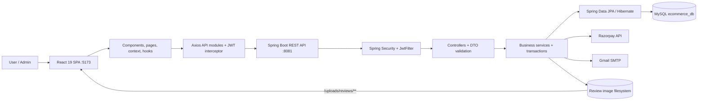
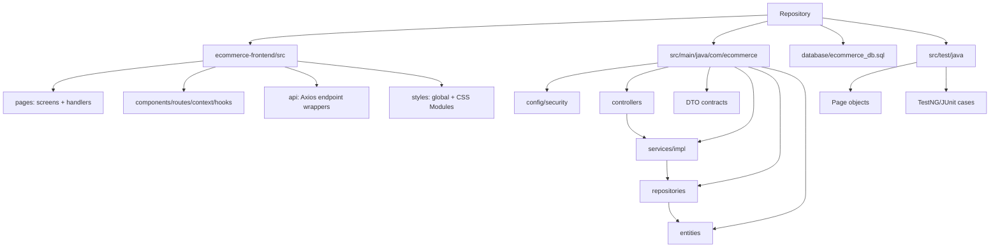
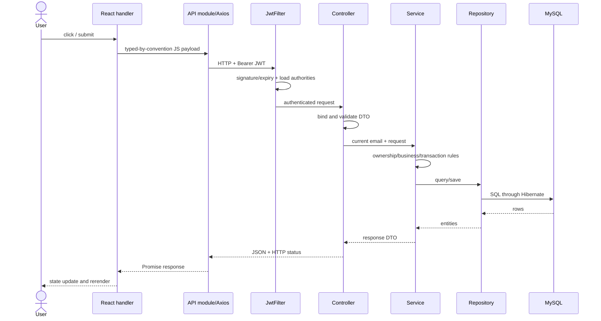
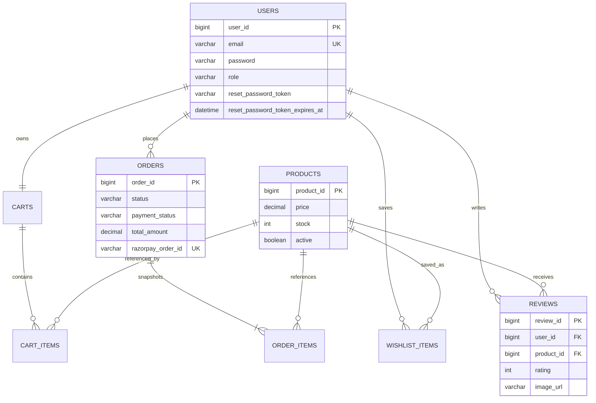
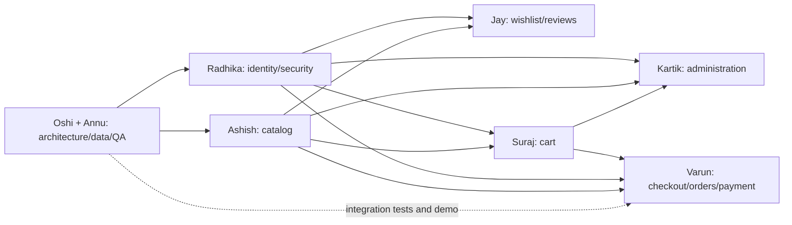
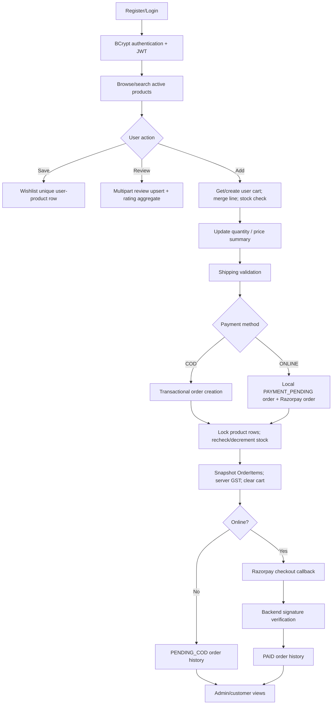

# Mercato E-Commerce: Technical Presentation Master Guide

> Repository-specific guide prepared from the current working tree on 28 June 2026. This describes the implementation that exists in the repository, including uncommitted review/rating work. It does not invent features that are not present.

## 0. Team-count decision

The request says **7 members**, but names **8 people**: Radhika, Oshi, Annu, Ashish, Jay, Suraj, Varun, and Kartik. This guide keeps all eight students and creates the requested **seven logical modules**. Module 1 is co-owned:

- **Oshi:** introduction, feature map, high-level architecture, and technology stack.
- **Annu (team lead):** database architecture, cross-module execution flow, test strategy, transitions, and live-demo control.

If the actual team has only seven presenters, merge the absent person's section using the dependency notes in Section 4.

## 1. Repository audit and verification

### 1.1 What was inspected

The audit covered:

- Root build and runtime configuration: `pom.xml`, Maven wrapper files, `.gitignore`, Spring properties, Vite/package configuration, and SQL bootstrap.
- All production Java packages: configuration, controllers, DTOs, entities, repositories, security, service interfaces, service implementations, exception handling, payment integration, mail, upload storage, and data initialization.
- All React application code: routing, context, API clients, shared components, custom hooks, customer pages, admin pages, and global/module styling.
- All Selenium/TestNG/JUnit code: test base, login utilities, page objects, component objects, and auth/product/cart/checkout/navigation test suites.
- Generated QA spreadsheets and their build/verification tools were identified as supporting QA artifacts, not runtime application dependencies.

### 1.2 Verification result

- Frontend production build: **passes** with Vite; 521 modules transformed. Output is roughly 478 KB JavaScript and 96 KB CSS before gzip.
- Frontend ESLint: **passes**.
- Backend compilation: **passes** after Maven resolves the missing dependencies from Central.
- Full Selenium execution was not run because MySQL, Spring Boot, Vite, and Chrome were not running during the audit. Ports 3306, 5173, and 8081 were not listening.
- The checked-in `mvnw.cmd` has a local Windows wrapper-script failure around indexing a null `Target`; direct Maven from the downloaded wrapper distribution compiles the project. This is an environment/bootstrap issue, not an application compilation error.

### 1.3 Important truthfulness notes for viva

- This is a **modular monolith**, not microservices.
- React state uses Context and local component/custom-hook state; it does **not** use Redux.
- Spring Data JPA generates most SQL from repository method names; only the product lock and review average use explicit JPQL.
- Product deletion is a soft delete (`active=false`); ordinary user deletion is a physical delete.
- Online payment creation reserves stock and clears the cart before payment completes. A cancelled payment leaves a `PAYMENT_PENDING` order and reduced stock; there is no retry/refund/stock-release workflow in the current UI.
- Reviews are account-linked but are not restricted to verified purchasers.
- `application-local.example.properties` currently contains what look like test payment credentials. Rotate them and replace them with placeholders before showing or sharing the repository.

## 2. Overall project analysis

### 2.1 Purpose and minor problem statement

**Purpose:** Mercato is a learning-oriented full-stack e-commerce platform demonstrating a realistic customer purchase journey and role-based administration with React, Spring Boot, and MySQL.

**Minor problem statement:** Users need one secure application in which they can discover products, preserve shopping intent, manage quantities, pay or choose COD, view orders, and manage their account; administrators need controlled catalog and user/cart visibility. The project solves this by joining a responsive SPA to a layered REST backend and relational persistence.

Keep this section under one minute. The presentation's real weight should be on feature logic, request flow, persistence, security, and live behavior.

### 2.2 Implemented features

**Customer identity**

- Registration with Bean Validation, unique email checking, BCrypt hashing, immediate JWT issuance.
- Login using Spring Security's `AuthenticationManager` and a 24-hour HS256 JWT.
- Token restoration with `/api/auth/me`; global 401 handling; protected and admin-only routes.
- Profile read/update, email uniqueness check, password change after current-password verification, and JWT reissue after email change.
- Forgot/reset password with cryptographically random single-use token, SHA-256 token storage, 30-minute expiry, optional Gmail delivery, and a development fallback reset link.

**Shopping experience**

- Active-product listing, product detail, name search, category filter, stock display, INR formatting, responsive light/dark UI, and Framer Motion detail animations.
- Persistent per-user wishlist with optimistic UI updates and cross-component browser events.
- Ratings and reviews with one review per user/product, update-on-resubmit behavior, aggregate rating/count, optional image upload, and static image serving.
- Persistent per-user cart; add, merge duplicate product, quantity change, remove, clear, server-side stock validation, price snapshot, totals, and navbar count synchronization.

**Purchase flow**

- Shipping form with client and server validation.
- Server-authoritative subtotal, 18% GST, free delivery, order and order-item snapshots.
- COD order path and Razorpay order/signature-verification path.
- Transactional checkout with pessimistic product row locks to prevent overselling.
- User-specific order history sorted newest first.

**Administration and quality**

- Role-gated admin area for product create/update/deactivate/reactivate, user listing/deletion, and all-cart inspection.
- Selenium Page Object Model suites for registration, login/logout, navigation, product list/detail/search/filter, cart arithmetic/edge cases, and COD checkout validation/history.
- Seed SQL for admin/products and a Spring startup initializer for demo reviewers/reviews.

### 2.3 High-level architecture

The browser runs a React 19 single-page application. Components call small Axios API modules. One Axios instance adds the JWT to every request. Spring Security validates the token before a controller receives protected traffic. Controllers translate HTTP concerns into DTO calls, services implement business rules and transactions, repositories use JPA/Hibernate, and MySQL enforces relational constraints. External adapters are Gmail SMTP, Razorpay, product-image URLs, and local review-image storage.

### 2.4 Technology stack

| Layer | Technology | Repository evidence | Purpose |
|---|---|---|---|
| UI | React 19.2, React DOM | `ecommerce-frontend/package.json` | Component-based SPA |
| Navigation | React Router DOM 7.14 | `AppRoutes.jsx` | Public/protected/admin routing |
| HTTP | Axios 1.15 | `axiosInstance.js`, API modules | REST calls and interceptors |
| UI style | CSS Modules, Tailwind CSS 4, global CSS variables | `src/styles`, `global.css` | Scoped styles, utility layout, theming |
| Motion | Framer Motion 12.41 | `ProductDetailPage.jsx` | Image/detail transitions |
| Build | Vite 8 | `vite.config.js` | Development server and production bundle |
| Backend | Java 17, Spring Boot 3.2.5 | `pom.xml` | REST application runtime |
| Security | Spring Security, BCrypt, JJWT 0.11.5 | `SecurityConfig`, `Jwt*` | Authentication and authorization |
| Validation | Jakarta Bean Validation | request DTOs | Boundary validation |
| Persistence | Spring Data JPA, Hibernate | repositories/entities | ORM and transactions |
| Database | MySQL/InnoDB | `database/ecommerce_db.sql` | Durable relational state |
| Payment | Razorpay Java SDK 1.4.8 + checkout.js | payment service/page | Hosted online payment |
| Email | Spring Mail/Gmail SMTP | `MailService` | Reset-link delivery |
| Upload | Spring multipart + NIO filesystem | review storage/config | Review image storage |
| QA | Selenium 4.21, TestNG 7.10, JUnit, WebDriverManager | `src/test/java` | Browser automation and context smoke test |

### 2.5 Folder structure and responsibility

```text
Ecommerce-fullstack/
├── pom.xml                         Java dependencies and backend build
├── src/main/java/com/ecommerce/
│   ├── config/                     Security, static upload mapping, seed runner
│   ├── controller/                 REST endpoints
│   ├── dto/                        Validated input/output contracts
│   ├── entity/                     JPA model and relationships
│   ├── exception/                  Central validation/runtime responses
│   ├── repository/                 Spring Data query abstraction
│   ├── security/                   JWT filter/util and UserDetails loading
│   └── service/                    Business interfaces, implementations, adapters
├── src/main/resources/             Spring runtime properties
├── src/test/java/                  Selenium/TestNG POM tests and JUnit smoke test
├── database/ecommerce_db.sql       Reproducible schema and starter data
├── ecommerce-frontend/
│   ├── package.json                UI dependencies/scripts
│   └── src/
│       ├── api/                    Axios endpoint functions
│       ├── components/             Shared layout, guards, navbar, rating display
│       ├── context/                Global authentication state
│       ├── hooks/                  Reusable wishlist state/optimistic updates
│       ├── pages/                  Customer and admin screens
│       ├── routes/                 Route table
│       └── styles/                 Global tokens and CSS Modules
├── tools/                          QA workbook construction/verification scripts
└── outputs/                        Generated QA workbook artifacts
```

### 2.6 Startup and execution flow

1. MySQL schema is created/imported as `ecommerce_db`; Hibernate is also configured with `ddl-auto=update`.
2. Spring Boot starts on `8081`, scans components, creates beans, registers security/filter chains and JPA repositories, and maps `/uploads/reviews/**` to the local upload directory.
3. `ReviewDataInitializer` runs after startup. It creates three demo users if needed and adds three reviews to products that have no reviews.
4. Vite starts the React app on `5173`. `main.jsx` renders `App` inside `StrictMode`.
5. `App` applies the saved/system theme, installs `BrowserRouter`, and wraps routes in `AuthProvider`.
6. `AuthProvider` checks stored credentials. A real token is verified through `/api/auth/me`; no token sends protected pages to login.
7. A user action calls an API wrapper. Axios attaches `Authorization: Bearer <JWT>`.
8. Spring Security's `JwtFilter` validates signature/expiry, loads current authorities, and fills `SecurityContext`.
9. Controller -> service -> repository -> Hibernate -> MySQL handles the request. A response DTO returns JSON.
10. React updates local/context/hook state and rerenders. Browser custom events synchronize cart/wishlist counts between independent components.

### 2.7 Frontend -> backend -> database example: Add to cart

1. `ProductsPage.handleAddToCart` sends `{productId, quantity: 1}` using `CartApi.addToCart`.
2. The Axios request interceptor adds the JWT and posts to `/api/cart`.
3. `JwtFilter` authenticates the email; `CartController` obtains it through `@AuthenticationPrincipal`.
4. `CartServiceImpl.addToCart` loads/creates the user's cart, loads the product, checks `active` and stock, and queries for an existing row.
5. Existing line: add quantities and recheck stock. New line: store product, quantity, and the current price snapshot.
6. JPA persists `cart_items`, reloads/maps the cart, and returns item totals and cart totals.
7. React shows “Added,” dispatches `cart:updated`, and `Navbar` refetches the count.

### 2.8 Authentication and authorization flow

- Registration hashes passwords with BCrypt; raw passwords are never intentionally returned.
- Login delegates credential checking to Spring Security instead of manually comparing password strings.
- JWT subject is the user's email; expiry is configured as 86,400,000 ms.
- The JWT contains no role. On every authenticated request the database-backed `CustomUserDetailsService` reloads the user and derives `ROLE_<role>`, so role changes take effect without waiting for token expiry.
- `SecurityConfig` permits auth endpoints, product GETs, and uploaded images. `/api/admin/**` requires `ROLE_ADMIN`; all other endpoints require authentication.
- Frontend guards improve navigation experience, but backend authorization is the actual security boundary.
- Logout is client-side token deletion because the server is stateless and has no token blacklist.

### 2.9 API communication and error model

All frontend API paths are relative to `http://localhost:8081/api`. JSON is the default except review creation, which uses multipart form data. Validation failures become a `400` field-to-message map. Runtime exceptions become `{ "error": "..." }` with `400`. Axios globally handles `401` by deleting local credentials and redirecting to login.

One weakness to acknowledge: the global handler maps every `RuntimeException` to 400, so not-found, conflict, forbidden business action, and internal adapter failures are not semantically separated into 404/409/403/500.

### 2.10 State management

- `AuthContext`: shared authenticated user plus `login`, `logout`, and `updateUser`.
- Local component state: forms, products, cart, orders, loading/errors, selection, review form, and admin tables.
- `useFavorites`: reusable server-backed wishlist state, optimistic toggle with rollback, custom-event synchronization, and a demo-token localStorage branch.
- Local storage: JWT, user snapshot, theme, demo favorites.
- Browser events: `cart:updated`, `favorites:updated`, and native `storage` provide lightweight cross-component synchronization.
- Server/MySQL is authoritative for users, catalog, wishlist, reviews, cart, order, payment status, and stock.

### 2.11 Design patterns in the code

- **Layered architecture:** controller -> service -> repository.
- **Repository pattern:** Spring Data repository interfaces isolate persistence access.
- **DTO pattern:** request/response models isolate API contracts from JPA entities.
- **Dependency injection:** Spring-managed collaborators; mostly field injection, with constructor injection in newer services/controllers.
- **Strategy/adaptor-like branches:** COD and Razorpay use distinct endpoints/service paths; SMTP/payment/storage services isolate external concerns.
- **Front Controller/filter chain:** Spring MVC dispatcher and security filter process requests centrally.
- **Provider/custom hook:** React Context and `useFavorites` share behavior/state.
- **Route guard:** `ProtectedRoute` and `AdminRoute` gate client-side navigation.
- **Page Object Model:** Selenium page objects separate locators/actions from assertions.
- **Optimistic UI:** wishlist changes render immediately and roll back on API failure.
- **Snapshot pattern:** cart price and order item name/image/unit price preserve commercial history.
- **Soft delete:** product deactivation preserves referenced history.

## 3. Complete API map

| Method and path | Access | Controller -> principal service | Main persistence/effect |
|---|---|---|---|
| POST `/api/auth/register` | Public | Auth -> `register` | Insert user, return JWT |
| POST `/api/auth/login` | Public | Auth -> `login` | Authenticate/read user, return JWT |
| POST `/api/auth/forgot-password` | Public | Auth -> `forgotPassword` | Hash/store reset token; optional mail |
| POST `/api/auth/reset-password` | Public | Auth -> `resetPassword` | Replace BCrypt hash; clear token |
| GET `/api/auth/me` | JWT | Auth -> `getProfile` | Read current user |
| GET/PUT `/api/auth/profile` | JWT | Auth -> profile methods | Read/update user; optional JWT reissue |
| GET `/api/products` | Public backend | Product -> `getAllProducts` | Active products + rating aggregates |
| GET `/api/products/{id}` | Public backend | Product -> `getProductById` | Active product detail |
| GET `/api/products/search` | Public backend | Product -> `searchProducts` | Keyword/category query |
| POST `/api/products` | Any JWT in current config | Product -> `addProduct` | Insert product |
| GET/POST `/api/products/{id}/reviews` | JWT in practice | Review service | List/upsert review and optional file |
| GET/POST/DELETE `/api/wishlist[/{productId}]` | JWT | Wishlist service | Read/insert/delete wishlist item |
| GET/POST/DELETE `/api/cart` | JWT | Cart service | Read/add/clear cart |
| PUT/DELETE `/api/cart/{cartItemId}` | JWT | Cart service | Update/delete owned line |
| POST `/api/orders/checkout` | JWT | Order -> `checkout` | Transactional COD order |
| GET `/api/orders` | JWT | Order -> `getUserOrders` | User-scoped history |
| POST `/api/payments/razorpay/order` | JWT | Payment -> `createOrder` | Local pending order + Razorpay order |
| POST `/api/payments/razorpay/verify` | JWT | Payment -> `verifyPayment` | Verify HMAC; mark paid |
| GET/POST/PUT/DELETE `/api/admin/products...` | Admin | Admin product methods | Full catalog CRUD/soft delete |
| GET/DELETE `/api/admin/users...` | Admin | Admin user methods | List/delete non-admin user |
| GET `/api/admin/carts` | Admin | Admin -> `getAllCarts` | Cross-user cart view |

**Security issue professors may spot:** `POST /api/products` is not under `/api/admin/**`; current security config therefore permits any authenticated user to call it. The UI does not expose this, but backend authorization should explicitly restrict this endpoint or remove it in favor of the admin endpoint.

## 4. Seven-module team division

| Module | Owner | Scope | Why separate | Speaking time | Difficulty | Key dependencies |
|---|---|---|---|---:|---|---|
| 1. Architecture, data, integration, QA | **Oshi + Annu** | Oshi: intro/features/architecture/stack. Annu: DB, complete flow, testing, transitions/demo | Cross-cutting system model needs both an architectural narrator and integration lead | 5 min each | High | Every module |
| 2. Identity, security, profile | **Radhika** | register/login/JWT/guards/profile/reset mail | Security is a complete vertical slice and attracts deep viva questions | 6 min | High | User table, Axios, Spring Security |
| 3. Catalog and product discovery | **Ashish** | listing/detail/search/filter/rating summaries/UI | Catalog is the entry point and shared dependency for commerce features | 5 min | Medium | Products/reviews, cart/wishlist |
| 4. Wishlist, reviews, image upload | **Jay** | favorites state, persistence, review upsert/aggregate/upload | Engagement state has distinct optimistic and multipart workflows | 6 min | High | Auth, products, filesystem |
| 5. Cart and pricing state | **Suraj** | cart lifecycle, ownership, stock checks, snapshots, totals/events | Cart is a stateful aggregate and boundary between discovery and purchase | 6 min | High | Auth, products, checkout |
| 6. Checkout, orders, Razorpay | **Varun** | validation, transactions, stock locking, tax, COD/online, history | Highest-risk transactional business path | 7 min | Very high | Cart, user, product, payment API |
| 7. Administration | **Kartik** | role routing, product management, user deletion, cart oversight | Separate role, UI shell, and authorization boundary | 5 min | High | Auth/roles, products/users/carts |

Recommended main-talk duration: **45 minutes**, followed by an **8-10 minute live demo**. If the college slot is 30 minutes, use 3 minutes for Oshi, 3 for Annu, 3-4 per feature owner, and 6 minutes for demo.

## 5. Professional slide flow (feature/logic focused)

### Slide 1 — Title and one-sentence system definition (Oshi, 30 sec)

Say: “Mercato is a full-stack modular monolith implementing the authenticated purchase lifecycle—from discovery and saved intent through stock-safe checkout and role-based administration.” Introduce the eight presenters and seven modules. Do not spend time on market competition.

Screenshot: full browser capture of `/dashboard`; source screen `DashboardPage.jsx`.

### Slide 2 — Minor problem and implemented feature map (Oshi, 45 sec)

Say: users need secure identity, discoverability, persistent cart/wishlist, dependable checkout, order traceability, and administration. Point to the seven implemented feature groups; avoid future scope.

Screenshot: a collage of `/login`, `/products`, `/cart`, `/checkout`, and `/admin/products`. Source pages: `LoginPage.jsx`, `ProductsPage.jsx`, `CartPage.jsx`, `CheckoutPage.jsx`, `AdminProducts.jsx`.

### Slide 3 — System boundaries and architecture (Oshi, 2 min)

Say: browser SPA -> REST/JWT backend -> JPA/MySQL, with Razorpay, SMTP, and filesystem as adapters. Emphasize modular monolith, stateless API security, DTO boundaries, and server-authoritative rules.

Screenshot: render the Overall Architecture Mermaid diagram from Section 7.1. Beside it show `App.jsx`, `SecurityConfig.java`, and one service/repository chain—not an unreadable full file.

### Slide 4 — Tech stack and repository map (Oshi, 1.5 min)

Say why each technology exists, not just its name. React renders and manages interaction state; Axios transports; Spring Security authenticates; services own rules; JPA maps objects; MySQL enforces relationships; Selenium verifies journeys.

Screenshot: IntelliJ/VS Code explorer expanded at `ecommerce-frontend/src` and `src/main/java/com/ecommerce`; source folders from Section 2.5. Add logos only as small labels.

### Slide 5 — Database and domain model (Annu, 2 min)

Say: User owns one Cart; Cart has CartItems; Product is referenced by carts, wishlists, reviews, and order items; User owns Orders; Order snapshots its OrderItems. Explain unique constraints and delete actions. Mention reset-token columns are added by Hibernate but absent from the SQL bootstrap and should be synchronized.

Screenshot: ER diagram from Section 7.5 plus MySQL Workbench table list/schema for `ecommerce_db`; source `database/ecommerce_db.sql` and entity classes.

### Slide 6 — End-to-end request and security pipeline (Annu, 2 min)

Say: UI handler -> API wrapper -> Axios JWT -> security filter -> controller -> service transaction -> repository -> MySQL -> DTO -> state/render. Explain that frontend guards are UX; Spring authorization is enforcement.

Screenshot: browser Network panel for `GET /api/cart` showing request URL/status and redacted Authorization header; code clips from `axiosInstance.js`, `JwtFilter.java`, `CartController.java`.

### Slide 7 — Authentication, reset, and profile (Radhika, 4-5 min)

Say: registration hashes; login delegates to `AuthenticationManager`; JWT subject is email; requests reload authorities; profile email change issues a fresh token; reset uses random token, stores only SHA-256 digest, expires in 30 minutes, and clears after use.

Screenshot: `/login`, `/forgot-password`, and `/profile`; Network panel for `/api/auth/login`; BCrypt-looking value in MySQL with most characters blurred; authentication diagram Section 7.3.

### Slide 8 — Catalog discovery and product details (Ashish, 4 min)

Say: active-only products, derived repository queries, optional keyword/category behavior, response mapping with review aggregate, stock-aware controls, gallery normalization, and concurrent product/review loading with `Promise.all`.

Screenshot: `/products` after search/category filter and `/products/{id}`. Code snippets: `ProductServiceImpl.searchProducts`, `ProductRepository`, `ProductsPage.handleSearch`.

### Slide 9 — Wishlist, ratings, reviews, and upload (Jay, 4-5 min)

Say: wishlist uniqueness is enforced in both service and DB; hook performs optimistic update/rollback and broadcasts changes. Review POST is multipart; one review per user/product means resubmit updates; rating average is JPQL; image names use UUID and extension/type controls.

Screenshot: heart toggled on product, `/wishlist`, review form/photo, and resulting review. Network panel for multipart review; code snippets `useFavorites.toggleFavorite`, `ReviewServiceImpl.saveReview`, `ReviewImageStorageService.store`.

### Slide 10 — Cart aggregate and pricing (Suraj, 4-5 min)

Say: cart is lazily created per user; duplicate adds merge; item ownership blocks ID tampering; stock is checked on add and update; quantity <= 0 removes; item price is snapshotted; server maps totals; events refresh navbar count.

Screenshot: `/cart` with 2 items and totals; Network calls POST/PUT/DELETE `/api/cart`; code snippets `CartServiceImpl.addToCart` and `updateQuantity`.

### Slide 11 — Checkout transaction and stock consistency (Varun, 4 min)

Say: client validates phone/pincode for usability, DTO validates required fields, service recalculates totals, locks each product row using `PESSIMISTIC_WRITE`, decrements stock, snapshots order lines, calculates 18% GST with `BigDecimal`, saves order, clears cart—all in a transaction.

Screenshot: filled `/checkout` COD form, SQL console/DB before-and-after stock/order rows, and transaction diagram Section 7.7. Code: `OrderServiceImpl.createOrder`, `ProductRepository.findByIdForUpdate`.

### Slide 12 — Razorpay branch and order history (Varun, 3 min)

Say: server creates trusted local amount, converts rupees to paise exactly, creates Razorpay order, returns public key/order metadata, browser opens hosted checkout, backend verifies signature using secret, and then marks order paid. Never trust a browser “success” alone.

Screenshot: Razorpay test modal (redact personal/payment data), `/checkout/success`, `/orders`; Network calls `/payments/razorpay/order` and `/verify`; payment diagram.

### Slide 13 — Role-based admin operations (Kartik, 4-5 min)

Say: client `AdminRoute` checks role for navigation, but `/api/admin/**` is protected with `hasRole("ADMIN")`. Admin sees active/inactive products, performs soft deletion/reactivation, cannot delete admin users, and can inspect user carts.

Screenshot: `/admin/products` edit modal, `/admin/users`, expanded `/admin/carts`; code clips `SecurityConfig`, `AdminServiceImpl.deleteProduct/deleteUser`.

### Slide 14 — Automated verification (Annu, 2 min)

Say: Page Object Model centralizes locators/actions; TestNG classes own scenarios; `BaseTest` owns WebDriver lifecycle/waits; unique emails make registration repeatable; the demo-session token supports UI-only tests, while true login/checkout require the backend.

Screenshot: `src/test/java` folder, one page object plus one test assertion, and terminal output from a successful selected test run. Do not claim the complete suite passed unless it is run on presentation day.

### Slide 15 — Implementation decisions and current limitations (Annu, 1.5 min)

Focus on logic, not future scope. Say: snapshots preserve history, soft delete preserves references, database constraints back service checks, and pessimistic locks prioritize correctness. Then honestly state current gaps: pending-payment stock is not released, review purchase verification is absent, global error statuses are coarse, product POST authorization is too broad, JWT localStorage has XSS exposure, and aggregate queries can cause N+1 behavior.

Screenshot: a two-column “Decision / Tradeoff” table built from this paragraph. Use code references, not generic competitor slides.

### Slide 16 — Live demo route and conclusion (Annu, 1 min before demo)

Say: “We will now follow one entity-rich journey: register/login -> discover -> save/review -> cart -> COD order -> database verification -> admin change.” Define what each presenter will prove.

Screenshot: numbered demo storyboard from Section 8 and the Complete Execution Flow diagram.

## 6. Screenshot capture matrix

| Slide | Exact screen/file | What must be visible | Capture advice |
|---|---|---|---|
| 1 | Browser `/dashboard`; `DashboardPage.jsx` | greeting, three feature cards, navbar | Use a named demo user; hide bookmarks |
| 2 | `/login`, `/products`, `/cart`, `/admin/products` | feature breadth | Four equal crops, same theme |
| 3 | Section 7.1; `App.jsx`, `SecurityConfig.java` | system boundaries | Highlight only 6-12 relevant lines |
| 4 | Project explorer; `package.json`, `pom.xml` | folders and versions | Collapse generated `target/dist/node_modules` |
| 5 | MySQL Workbench `ecommerce_db`; `database/ecommerce_db.sql`; entities | 8 tables, PK/FK links | Use ER model, not raw 178-line SQL |
| 6 | DevTools Network `GET /api/cart`; `axiosInstance.js`; `JwtFilter.java` | Bearer flow, 200 JSON | Redact token after first 8 characters |
| 7 | `/login`, `/forgot-password`, `/profile`; `AuthServiceImpl.java` | auth/reset/profile outcomes | Never expose real reset/JWT tokens |
| 8 | `/products?` UI and `/products/{id}`; `ProductServiceImpl.java` | filter results, rating, stock | Search a term with 2+ results |
| 9 | `/wishlist`, product review section; `useFavorites.js`, `ReviewServiceImpl.java` | persisted heart and uploaded image | Use a small non-sensitive test image |
| 10 | `/cart`; `CartServiceImpl.java`; Network POST/PUT | quantity and recomputed total | Record before/after quantity |
| 11 | `/checkout`; Workbench `products/orders/order_items`; `OrderServiceImpl.java` | validation and atomic results | Query only demo order IDs |
| 12 | Razorpay test modal, `/orders`; `RazorpayPaymentService.java` | order ID and paid status | Use test mode; blur phone/email |
| 13 | `/admin/products`, `/admin/users`, `/admin/carts`; `AdminServiceImpl.java` | soft delete and role controls | Prepare disposable product/user |
| 14 | `src/test/java`; terminal selected test result | POM structure and evidence | Run selected stable tests, keep log short |
| 15 | Decision/tradeoff slide with cited file names | honest engineering analysis | No generic future-scope bullets |
| 16 | demo storyboard + Section 7.7 diagram | exact click order | Keep as presenter's cue card |

## 7. Architecture diagrams

### 7.1 Overall architecture



### 7.2 Folder/dependency structure



### 7.3 Authentication flow

```mermaid
sequenceDiagram
    actor User
    participant UI as Login/Register page
    participant AX as Axios
    participant SC as Security/Auth controller
    participant AS as Auth service
    participant DB as User repository/MySQL
    participant JWT as JwtUtil
    User->>UI: submit credentials
    UI->>AX: POST /api/auth/login
    AX->>SC: public request
    SC->>AS: login(LoginRequest)
    AS->>SC: AuthenticationManager.authenticate
    SC->>DB: UserDetailsService.findByEmail
    DB-->>SC: BCrypt hash + role
    SC-->>AS: authenticated
    AS->>DB: load User
    AS->>JWT: generateToken(email)
    JWT-->>AS: signed 24-hour JWT
    AS-->>UI: token + safe user DTO
    UI->>UI: localStorage + AuthContext + navigate
    Note over AX,SC: Later requests attach Bearer token; JwtFilter validates it and loads current role
```

### 7.4 Generic API flow



### 7.5 Database relations



### 7.6 Module dependencies



### 7.7 Complete execution flow: purchase lifecycle



## 8. Live demonstration plan

### 8.1 Preparation checklist (before professors enter)

1. Use test credentials only. Rotate/remove any committed Razorpay-looking secret first.
2. Import/update MySQL schema and verify Spring properties through a private local file or environment variables.
3. Start MySQL, then Spring Boot on 8081, then Vite on 5173.
4. Verify `GET /api/products` and open `/login`.
5. Create: one normal demo user, one admin, one disposable product with stock >= 5, and a small review image.
6. Open four prepared tabs: application, DevTools Network, MySQL Workbench, and IDE at `OrderServiceImpl`.
7. Keep a screen recording and a short screenshot deck as backup. Disable real browser autofill/popups/notifications.

### 8.2 Primary demo script (8-10 minutes)

| Step / owner | Click/type | Say | Expected proof |
|---|---|---|---|
| 1 Oshi | Open `/login`, log in as normal user | “The SPA authenticates through the REST API; the route is public but the dashboard is protected.” | Dashboard with user name; login request 200 |
| 2 Radhika | Briefly open Profile, then return | “Context restores the identity from a backend-verified JWT; profile changes can reissue the token.” | Profile DB data, no password exposed |
| 3 Ashish | Open Products; search/filter; open a detail | “Only active products are returned; search and ratings are composed in response DTOs.” | Correct subset/detail/stock/rating |
| 4 Jay | Toggle heart; open Wishlist; add/update a review with image | “Wishlist is persistent and optimistic; review is an account-scoped upsert sent as multipart.” | Heart persists; review count/average/image update |
| 5 Suraj | Add quantity 1, open Cart, increase to 2 | “The service merges lines, validates stock and ownership, and returns calculated totals.” | Navbar/cart totals update; PUT request |
| 6 Varun | Checkout via COD with valid details | “The backend locks product rows, recalculates GST, snapshots order items, decrements stock, saves order, and clears cart atomically.” | Success screen and newest order |
| 7 Annu | Show DB `orders`, `order_items`, updated `products.stock`, empty `cart_items` | “These rows prove one user action crossed every layer while preserving history.” | Matching IDs/amounts/stock |
| 8 Kartik | Login as admin; open Products; deactivate/reactivate disposable product; show Carts/Users | “Role is enforced by Spring Security. Product delete is intentionally soft.” | Admin only screens; active state changes |
| 9 Annu | Show one selected Selenium result | “Automation mirrors user journeys through reusable page objects.” | Short passing test log |

### 8.3 Optional Razorpay extension (2 minutes)

Use a separate preloaded cart so the COD path remains safe. Select Online, open the Razorpay test modal, and complete with test data. Show `/payments/razorpay/order`, then `/verify`, then `PAID` order history. Explain that the secret never goes to the browser and the backend validates the signature.

### 8.4 Failure-safe alternatives

- **Frontend unavailable:** use the production `npm run build` result and screenshots/video; demonstrate API through Postman/curl if Spring is available.
- **Backend unavailable:** use recorded Network responses plus IDE flow. Do not use the fake `demo-video-token` and claim it proves backend security; it only supports UI test setup.
- **MySQL unavailable:** use a read-only SQL export/ER diagram and a recorded before/after query.
- **Razorpay/network unavailable:** demonstrate COD live, then show a recorded test-mode online payment and explain signature verification code.
- **Mail unavailable:** the current development branch returns a reset link when SMTP is not configured; label this explicitly as a development fallback.
- **Image upload fails:** submit a text-only review, then show the prepared upload screenshot and storage path.
- **Selenium/Chrome fails:** show the source relationship between one TestNG test and its page object plus a previous terminal log; never fake a live pass.

## 9. Cross-module engineering findings professors may probe

1. The frontend imports files with inconsistent casing (`cartApi` vs `CartApi`, `productApi` vs `ProductApi`, `OrderApi`). It works on Windows' case-insensitive filesystem but may fail on Linux CI/deployment.
2. `POST /api/products` is authenticated but not admin-only. Protect it explicitly or remove it.
3. Review GET is under a route that SecurityConfig does not publicly permit; although the controller accepts a null principal, current security normally blocks unauthenticated calls. Code intention and security policy are inconsistent.
4. Password reset columns exist in `User` but not in the SQL script; `ddl-auto=update` masks schema drift.
5. `Cart.getTotalPrice()` returns `double`, while monetary values elsewhere use `BigDecimal`; use `BigDecimal` end to end.
6. Product/review mapping runs average and count queries per product, producing an N+1 aggregate-query pattern.
7. Online checkout reserves stock and clears cart before successful payment, without expiry compensation.
8. `ReviewImageStorageService` checks declared MIME prefix and extension but not file signatures; stronger production validation and malware scanning are needed.
9. Old review images are not deleted when replaced, creating orphan files.
10. JWT in localStorage is simple but exposed to successful XSS. HttpOnly Secure SameSite cookies plus CSRF strategy are a production alternative.
11. Entities generated with relationship-inclusive `equals/hashCode/toString` can recurse, trigger lazy loading, and expose password text in logs. Entity equality should normally be identifier-focused and `User.toString` must exclude secrets.
12. Field injection and `@Lazy` solve wiring quickly but constructor injection and a cleaner authentication dependency graph improve testability.
13. CORS is repeated per controller and fixed to localhost; central environment-specific configuration is cleaner.
14. The runtime exception handler exposes messages and always returns 400; use typed exceptions and correct statuses.
15. Full product response mapping is duplicated across Product, Admin, and Wishlist services; a mapper component/projection would reduce drift.

## 10. Final all-team knowledge checklist

Every presenter should be able to tick all items before rehearsal:

- [ ] I can state whether the system is a modular monolith or microservices and justify it.
- [ ] I can trace my feature from React event to MySQL row and back.
- [ ] I know every endpoint my module calls and whether it is public, JWT, or admin-only.
- [ ] I can explain the DTO/entity difference and identify validation at both client and server.
- [ ] I can name my module's tables, keys, unique constraints, and delete behavior.
- [ ] I know where authentication is enforced and why frontend guards are insufficient.
- [ ] I can explain loading, error, empty, success, and edge-case behavior.
- [ ] I can discuss one correct design choice, one tradeoff, and one current limitation without pretending it is implemented.
- [ ] I can run my live-demo segment in under the allocated time.
- [ ] I know the presenter before and after me and can make a 10-second transition.
- [ ] I have studied the shared files: `AppRoutes.jsx`, `axiosInstance.js`, `SecurityConfig.java`, `GlobalExceptionHandler.java`, `database/ecommerce_db.sql`.
- [ ] I can answer “What happens if two users act at the same time?” for my module.

Detailed per-member study guides, 30-question viva banks, common traps, checklists, and two-minute revision sheets are in `MEMBER_TECHNICAL_GUIDES_AND_VIVA.md`.
